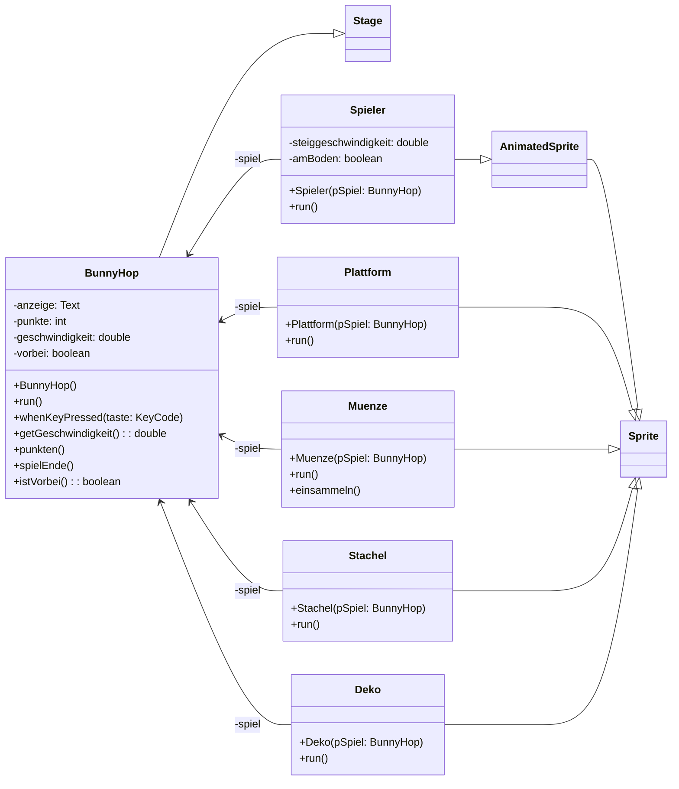

# Ideen sammeln

Ihr kennt jetzt die Grundlagen von Scratch for Java und habt ein vollständiges
Spiel gebaut. Ab hier wird es **euer** Spiel.

## Der Stand, auf dem ihr aufsetzt

Alle in der Gruppe starten mit demselben Projekt – dem fertigen Spiel aus der
letzten Lektion:

::archive[Projekt: Das fertige Spiel]{name="bunny-hop-07-deko"}

Sieben Klassen, von denen sechs auf der Bühne stehen:

```mermaid
classDiagram
  direction RL
  Stage <|-- BunnyHop
  Sprite <|-- AnimatedSprite
  AnimatedSprite <|-- Spieler
  Sprite <|-- Plattform
  Sprite <|-- Muenze
  Sprite <|-- Stachel
  Sprite <|-- Deko

  class BunnyHop {
    -anzeige: Text
    -punkte: int
    -geschwindigkeit: double
    -vorbei: boolean
    +BunnyHop()
    +run()
    +whenKeyPressed(taste: KeyCode)
    +getGeschwindigkeit(): double
    +punkten()
    +spielEnde()
    +istVorbei(): boolean
  }

  Spieler --> BunnyHop: -spiel

  class Spieler {
    -steiggeschwindigkeit: double
    -amBoden: boolean
    +Spieler(pSpiel: BunnyHop)
    +run()
  }

  Plattform --> BunnyHop: -spiel

  class Plattform {
    +Plattform(pSpiel: BunnyHop)
    +run()
  }

  Muenze --> BunnyHop: -spiel

  class Muenze {
    +Muenze(pSpiel: BunnyHop)
    +run()
    +einsammeln()
  }

  Stachel --> BunnyHop: -spiel

  class Stachel {
    +Stachel(pSpiel: BunnyHop)
    +run()
  }

  Deko --> BunnyHop: -spiel

  class Deko {
    +Deko(pSpiel: BunnyHop)
    +run()
  }
```

:::snippet{#merken}
Sechs Klassen zeigen auf `BunnyHop`, und keine zeigt auf eine andere. Die Bühne
ist der Ort, an dem alles zusammenläuft: Sie kennt den Punktestand, die
Geschwindigkeit und den Zustand des Spiels. Wer etwas Neues einbaut, hängt es
meistens genauso an die Bühne.
:::

## Aufgaben

### Das Programm verstehen

:::snippet{#aufgabe}
Bearbeitet die Fragen zu zweit am Quelltext:

a) In welchen Zeilen wird `punkten()` aufgerufen? Wer ruft es auf?

b) Beschreibt in eigenen Worten, was `getGeschwindigkeit()` zurückgibt, während
   das Spiel vorbei ist – und was das für die Plattformen bedeutet.

c) In `Plattform.run` steht `this.changeX(BunnyHop.PLATTFORMEN * BunnyHop.BREITE)`.
   Erklärt, warum dort nicht einfach `this.setX(450)` steht.

d) Erklärt, was passieren muss, damit `whenKeyPressed` etwas bewirkt.

e) Sammelt Zeilen, die ihr **nicht** nachvollziehen könnt, und klärt sie in der
   Gruppe oder mit eurer Lehrkraft.
:::

:::protect{password="bh-ideen-1" description="Lösungshinweise. Erfrage das Passwort bei deiner Lehrkraft oder sieh auf der Seite Lösungspasswörter nach."}

a) In `Spieler.run`, direkt nachdem eine Münze berührt und eingesammelt wurde.
   Bugs meldet der Bühne also, dass es etwas zu zählen gibt.

b) Sie gibt 0 zurück. Alle beweglichen Objekte fragen dieselbe Methode – die
   ganze Welt steht damit auf einen Schlag still, ohne dass eine einzige Klasse
   davon wissen muss.

c) `setX(450)` würde die Plattform an eine feste Stelle setzen. Da alle
   Plattformen im selben Bild ankommen könnten, entstünden Lücken oder
   Überlappungen. `changeX` verschiebt sie um genau eine Weltbreite – der Abstand
   zu den Nachbarn bleibt erhalten.

d) Das Spiel muss vorbei sein (`vorbei == true`), und es muss die Taste **r**
   sein. Sonst passiert nichts.

:::

### Ideen sammeln

:::snippet{#aufgabe}
Spielt euer Spiel ein paar Runden und sammelt auf eurem Kanban-Board Ideen. Was
fehlt euch? Was nervt? Was wäre lustig?

Schreibt jede Idee als **Epic** auf – eine Karte, die aus Sicht der Spielerin
beschreibt, was sie können soll. Zum Beispiel: „Ich kann das Spiel anhalten, wenn
jemand an die Tür klopft."
:::

Für einige Epics gibt es [fertige Hilfen](./epics) – dort steht jeweils die Idee,
ein paar Tipps und eine mögliche Lösung.

Weitere Ideen, die gut zum Spiel passen:

| Idee | Was ihr dafür braucht |
| --- | --- |
| Andere Grafiken (Ninja, Fliegender, Schneelandschaft) | `addCostume` mit anderen Namen |
| Ein zweiter Feind, der fliegt | eine neue Klasse wie `Stachel` |
| Power-Up: kurz unverwundbar | ein `boolean` und ein `Timer` |
| Ein Highscore, der Runden übersteht | ein `static`-Attribut |
| Zwei Spieler an einer Tastatur | ein zweites `Spieler`-Objekt mit anderen Tasten |
