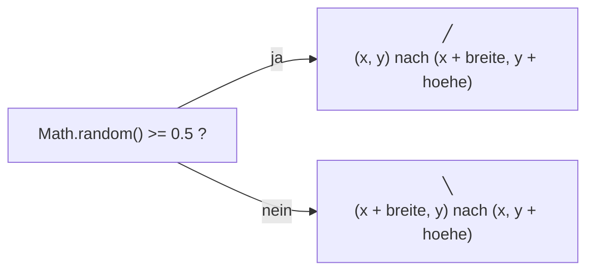

# Tiled Lines

Wir starten mit einem der ersten und zugleich einfachsten programmierten
Kunstwerke. Auf dem [Commodore 64](https://de.wikipedia.org/wiki/Commodore_64),
einem Heimcomputer aus dem Jahr 1982, passt es in eine einzige Zeile:

```basic
10 PRINT CHR$(205.5+RND(1)); : GOTO 10
```

Das Programm schreibt immer wieder zufällig eines von zwei Zeichen auf den
Bildschirm: einen Schrägstrich nach rechts `╲` oder einen nach links `╱`.
Heraus kommt ein Labyrinth, das niemand geplant hat. Über diese eine Zeile
gibt es sogar ein ganzes Buch – es heißt, natürlich, *10 PRINT*.

:::snippet{#merken}
**Vorwissen:** [verschachtelte Schleifen](/oberstufe/oop/01-grundlagen/03-kontrollstrukturen/06-verschachtelte-schleifen)
und [eigene Methoden](/oberstufe/oop/01-grundlagen/04-methoden-und-modularisierung/01-eigene-methoden).
:::

## Eine Linie

Der Stift kennt nur `setPosition`, `down` und `up`. Für eine einzelne Linie
von A nach B braucht man davon gleich vier Anweisungen. Weil wir in diesem
Projekt Tausende Linien ziehen, packen wir die vier in eine Methode `linie` –
die wirst du auf jeder Seite wiedersehen.

:::onlineide{libraries="scratch" height="500px" speed="1000000"}

```java Main.java
void main() {
   Window fenster = new Window(400, 400);
   fenster.setStage(new TiledLines());
}
```

```java TiledLines.java
public class TiledLines extends Stage {

   private Pen stift;

   public TiledLines() {
      this.setColor(245, 240, 230);
      stift = new Pen();
      this.add(stift);
      stift.setColor(30, 30, 30);
      stift.setSize(2);

      linie(-100, -100, 100, 100);
   }

   /**
    * Zieht eine gerade Linie von (pX1, pY1) nach (pX2, pY2).
    */
   private void linie(double pX1, double pY1, double pX2, double pY2) {
      stift.up();
      stift.setPosition(pX1, pY1);
      stift.down();
      stift.setPosition(pX2, pY2);
      stift.up();
   }
}
```

:::

:::snippet{#aufgabe}
a) Ergänze eine zweite Linie, sodass ein großes **X** entsteht.

b) Zeichne mit vier Aufrufen von `linie` einen **Rahmen** um die ganze
   Leinwand, 10 Bildpunkte vom Rand entfernt.
:::

::::collapsible{title="Tipp zu b)"}

Die Leinwand reicht von −200 bis 200. 10 Bildpunkte weiter innen liegen also
die Werte −190 und 190. Die linke untere Ecke ist (−190, −190).

::::

## Der Zufall entscheidet

Jetzt bekommt jede Zelle ihren Schrägstrich. Die Methode `zeichne` bekommt die
linke untere Ecke einer Zelle und ihre Größe. Dann wirft sie eine Münze:
`Math.random()` liefert eine Zufallszahl zwischen 0 und 1. Ist sie mindestens
0,5, geht der Strich von links unten nach rechts oben, sonst von rechts unten
nach links oben.



Damit die ganze Leinwand voll wird, laufen zwei geschachtelte Schleifen über
alle Zellen: die äußere von links nach rechts, die innere von unten nach oben.

:::onlineide{libraries="scratch" height="560px" speed="1000000"}

```java Main.java
void main() {
   Window fenster = new Window(400, 400);
   fenster.setStage(new TiledLines());
}
```

```java TiledLines.java
public class TiledLines extends Stage {

   private static final int SCHRITT = 20;

   private Pen stift;

   public TiledLines() {
      this.setColor(245, 240, 230);
      stift = new Pen();
      this.add(stift);
      stift.setColor(30, 30, 30);
      stift.setSize(2);

      for (int x = -200; x < 200; x += SCHRITT) {
         for (int y = -200; y < 200; y += SCHRITT) {
            zeichne(x, y, SCHRITT, SCHRITT);
         }
      }
   }

   /**
    * Zeichnet in eine Zelle zufällig einen der beiden Schrägstriche.
    * @param pX x-Koordinate der linken unteren Ecke
    * @param pY y-Koordinate der linken unteren Ecke
    */
   private void zeichne(int pX, int pY, int pBreite, int pHoehe) {
      if (Math.random() >= 0.5) {
         linie(pX, pY, pX + pBreite, pY + pHoehe);
      } else {
         linie(pX + pBreite, pY, pX, pY + pHoehe);
      }
   }

   /**
    * Zieht eine gerade Linie von (pX1, pY1) nach (pX2, pY2).
    */
   private void linie(double pX1, double pY1, double pX2, double pY2) {
      stift.up();
      stift.setPosition(pX1, pY1);
      stift.down();
      stift.setPosition(pX2, pY2);
      stift.up();
   }
}
```

:::

:::snippet{#aufgabe}
a) Starte das Programm mehrmals. Das Bild ist jedes Mal anders – woran
   erkennst du trotzdem, dass es immer dasselbe Kunstwerk ist?

b) Ändere die Konstante `SCHRITT` auf 10, 40 und 100. Ab wann ist das
   Labyrinth kein Labyrinth mehr?

c) Wie viele Linien zeichnet das Programm bei `SCHRITT = 20`? Rechne es
   zuerst aus, bevor du nachzählst.

d) Ersetze `0.5` durch `0.9`. Beschreibe, was passiert, und erkläre warum.
:::

::::collapsible{title="Tipp zu c)"}

Die äußere Schleife läuft von −200 bis 180 in Schritten von 20. Wie oft ist
das? Die innere läuft genauso oft – und zwar bei **jedem** Durchlauf der
äußeren.

::::

## Weiterspielen

:::snippet{#challenge}
**Verlauf.** Lass die Wahrscheinlichkeit von links nach rechts wandern: Ganz
links sind fast alle Striche `╱`, ganz rechts fast alle `╲`. In der Mitte
herrscht das Labyrinth.

*Statt der festen `0.5` brauchst du eine Zahl, die von `pX` abhängt. Für
pX = −200 soll sie nahe 0 sein, für pX = 180 nahe 1.*
:::

:::snippet{#challenge}
**Drei Möglichkeiten.** Erlaube neben den beiden Schrägstrichen eine dritte
Möglichkeit: einen waagerechten Strich durch die Mitte der Zelle. Wie musst
du die Zufallszahl aufteilen, damit alle drei gleich oft vorkommen?
:::

:::snippet{#challenge}
**Farbe.** Gib den beiden Richtungen verschiedene Farben. Oder: Lass die
Farbe mit der Höhe in der Leinwand langsam von Blau nach Rot wechseln.

*`stift.setColor(r, g, b)` darfst du vor jeder Linie neu aufrufen.*
:::

:::snippet{#challenge}
**Truchet-Kacheln.** Ersetze den Strich durch zwei Viertelkreise, die in
gegenüberliegenden Ecken der Zelle sitzen. Solche Muster heißen
**Truchet-Kacheln** – nach dem französischen Mönch Sébastien Truchet, der
1704 als Erster untersucht hat, was man mit zufällig gedrehten Kacheln legen kann.

*Einen Viertelkreis zeichnest du wie einen ganzen Kreis aus vielen kurzen
Linien – nur mit einem Viertel der Winkel. Wie man einen Kreis aus Linien
baut, steht auf der Seite [Circle Packing](./06-circle-packing).*
:::

---

Nach dem Tutorial [Tiled Lines](https://generativeartistry.com/tutorials/tiled-lines/)
von Generative Artistry.
