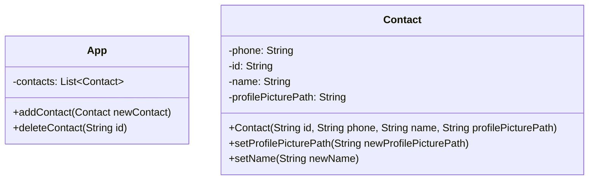

# Kontakte verwalten

Zu einem guten Messenger gehören auch Kontakte. Der Messenger soll daher, um die Möglichkeit Kontakte zu verwalten erweitert werden.

Deine Aufgabe ist es zu überlegen, welche Informationen von den Kontakten benötigt werden und welche angezeigt werden sollen.

## Modellierung

### Aufgaben

1. Sammle Funktionalitäten, die das Feature Kontakte bereitstellen soll (z.B. Kontakt hinzufügen)
2. Modelliere eine Klasse Kontakt, die zur Verwaltung der Kontakte im Messenger verwendet werden kann.
3. Erweitere das Klassendiagramm zum Messengerprojekt, sodass das Feature Kontakte umgesetzt ist.

## Unsere Modellierung

## Implementierung

### Aufgaben

1. Implementiere deine Modellierung. Gehe zunächst davon aus, dass Kontakte nicht über die Eingabe hinzugefügt werden sollen. Es reicht zunächst, wenn Kontakte über das Erstellen von Objekte in BlueJ hinzugefügt werden.
2. Implementiere die Kontaktverwaltung mittels der Eingabe.
