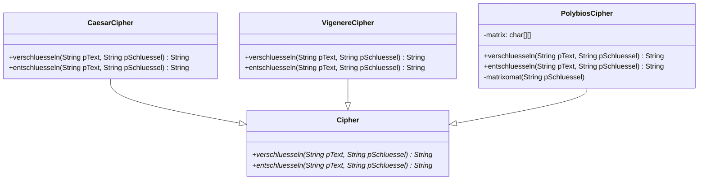

# Aufgabe

Die verschiedenen Verschlüsselungsalogrithmen sollen unter einer abstrakten Klasse zusammengefasst werden.

1. Modelliere eine abstrakte Klasse Cipher

## Unsere Modellierung

```mermaid
classDiagram

    class Cipher {
        +verschluesseln(String pText, String pSchluessel)* String
        +entschluesseln(String pText, String pSchluessel)* String
    }

    CaesarCipher --|> Cipher
    VigenereCipher --|> Cipher
    PolybiosCipher --|> Cipher

    class CaesarCipher {
        +verschluesseln(String pText, String pSchluessel) String
        +entschluesseln(String pText, String pSchluessel) String
    }

    class VigenereCipher {
        +verschluesseln(String pText, String pSchluessel) String
        +entschluesseln(String pText, String pSchluessel) String
    }

    class PolybiosCipher {
        -matrix: char[][]
        +verschluesseln(String pText, String pSchluessel) String
        +entschluesseln(String pText, String pSchluessel) String
        -matrixomat(String pSchluessel)
    }
```
