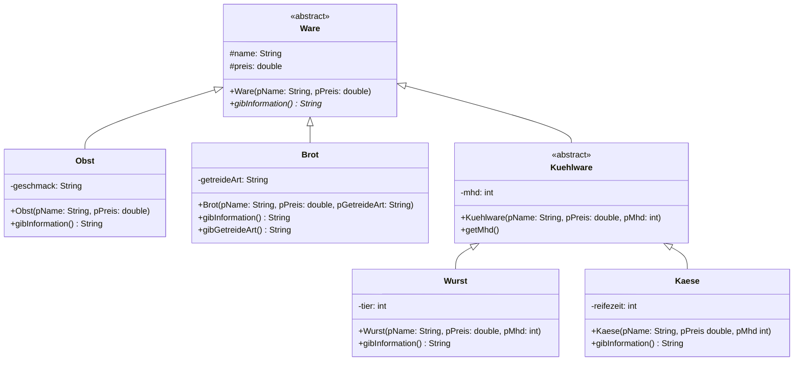

# Abstrakte Klassen

Nicht immer soll eine Klasse direkt vollständig implementiert werden bzw. kann auch nicht immer vollständig implementiert werden.

Nehmen wir an wir würden ein Warensystem für einen Supermarkt programmieren. In diesem System sollen verschiedene Waren verwaltet werden. Zum Beispiel Obst, Brot, Käse und Wurst. Für so ein System bietet sich natürlich das Konzept der Vererbung an. Ein mögliches Implementationsdiagramm könnte so aussehen:



In dieser Modellierung wurde die Klasse Ware und die Klasse Kuehlware als abstrakt modelliert. Das heißt, dass von diesen Klassen nicht direkt Objekte erzeugt werden können (instanziiert), sondern sie dienen nur als Vorlage für konkrete Klassen, die von ihnen abgeleitet werden.

## Super-Konstruktor

Der sogenannte "super-Konstruktor" in Java ist der Konstruktor der Oberklasse. Wenn wir eine Unterklasse einer abstrakten Klasse implementieren und in dieser einen Konstruktor implementieren, dann müssen wir den "super-Konstruktor" aufrufen.

```java
public abstract class Fahrzeug {
    private int tueren;
    public Fahrzeug(int pTueren) {
        this.tueren = pTueren;
    }
}

public class Smart extends Fahrzeug {
    public Smart() {
        super(2);
    }
}

public class Golf extends Fahrzeug {
    public Golf() {
        super(4);
    }
}
```

Der super-Konstruktor muss aufgerufen werden, um die Initialisierung der Oberklasse sicherzustellen. Sollte die Oberklasse keinen Konstruktor definieren, dann wird der Standardkonstruktor implizit aufgerufen.

```java

public abstract class Tier {
}

public class Fisch extends Tier {
    private String farbe;
    public Fisch(String pFarbe) {
        // hier wird vom Compiler super() eingefügt.
        this.farbe = pFarbe;
    }
}

public class Robbe extends Tier {
    private boolean istHungrig;
    public Robbe(boolean pIstHungrig) {
        // wird können ihn aber auch explizit aufrufen.
        super();
        this.istHungrig = pIstHungrig;
    }
}
```

Der Aufruf des super-Konstruktors ist also notwendig, um die Vererbungshierarchie in Java korrekt zu handhaben und sicherzustellen, dass alle Klassen in der Hierarchie ordnungsgemäß initialisiert werden.

## Abstrakte Methoden

Abstrakte Klassen können und definieren in der Regel auch abstrakte Methoden. Diese Methoden enthalten nur den Methodenkopf und werden in der abstrakten Klasse nicht implementiert.

```java
public abstract class Ware {
    // ...
    public abstract String gibInformation();
    // ...
}
```

Im Falle der Klasse Ware ist die Methode `gibInformation` abstrakt. In konkreten Klassen, die von der abstrakten Klasse erben muss die Methoden dann implementiert werden.

```java

public class Obst {
    // ...
    public String gibInformation() {
        return "Ich bin ein Obst!"
    }
    // ...
}
```

In der Klasse Obst muss also die Methode `gibInformation` implementiert werden.

In der Klasse Kuehlware hingegen nicht, da diese Klasse selbst abstrakt ist. Das heißt in solch einen Fall haben wir in der Implementierung die Freiheit zu entscheiden, ob wir die Methode in dieser Klasse implementieren oder die Implementierung erst in den konkreten Klassen vornehmen.

## Aufgabe: Warensystem

1. Überführe das obrige Implementationsdiagramm in Java Quelltext. Nutze dazu die Online-IDE. Die Methoden `gibInformation` sollen jeweils die Namen, den Preis und weitere Eigenschaften, z. B. die Getreideart, als zusammengesetzten String zurückgeben. Z. B.: `Backboard-Körner;3,99;Dinkel`.
2. Erstelle in der Klasse Warensystem weitere Objekte und füge sie dem Array `waren` hinzu.
3. Implementiere die Methode istVoll der Klasse Warensystem. Diese Methode soll ermitteln, ob das Array `waren` voll ist.
4. Implementiere die Methode gibWert der Klasse Warensystem. Diese Methode soll die Preise aller waren zusammenrechnen und somit den Wert aller Waren ermitteln.

:::onlineide

```java Warensystem.java

class Warensystem {
    private Ware[] waren;

    public Warensystem() {
        waren = new Ware[20];
        waren[0] = new Brot("Backboard-Körner", 3.99, "Dinkel");
    }

    public boolean istVoll() {
        return true;
    }

    public double gibWert() {
        return 0.0;
    }
}

```

```java Ware.java
    public abstract class Ware {}

```

```java Obst.java


```

```java Brot.java
    public class Brot {}

```

```java Kuehlware.java


```

```java Wurst.java


```

```java Kaese.java


```

:::
