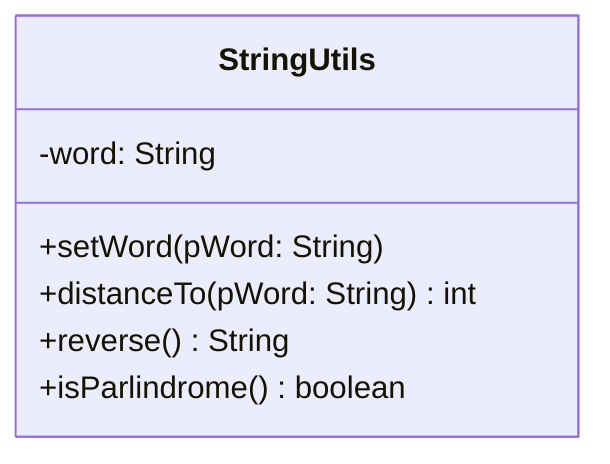

# Die Klasse String

Für Verschlüsselungsverfahren spielt die Klasse String eine große Rolle, da in der Regel Zeichen durch andere Zeichen ersetzt werden.

Daher werden wir zunächst lernen wie wir die Klasse String verwenden können.

Wir reduzieren uns dabei auf Methoden, die in den [Vorgaben des Zentralabiturs](<(https://www.standardsicherung.schulministerium.nrw.de/cms/zentralabitur-gost/faecher/getfile.php?file=5438)>) stehen. Denn mit diesen Methoden wird im Zentralabitur ein sicherer Umgang erwartet.

## Was ist ein String?

Doch zunächst schauen wir uns an was eigentlich ein sogenannter String ist. Deutlich wird dies, wenn wir den deutschen Begriff verwenden: Zeichenkette, Zeichenfolge oder auch Zeichenreihe.

Hieraus können wir schon ableiten, dass ein String sich aus mehreren Zeichen zusammensetzt.

Schauen wir uns also den Aufbau der Klasse String an, dann stellen wir fest, dass die Klasse sozusagen nur Methoden für ein Array des Datentyps char bereitstellt.

```java

// Auszug aus der Java-String-Klasse (siehe https://hg.openjdk.org/jdk8/jdk8/jdk/file/687fd7c7986d/src/share/classes/java/lang/String.java#l114)
public final class String {
    private final char value[];
    private int hash;

    // ...

    public String() {
        this.value = new char[0];
    }

    public String(String original) {
        this.value = original.value;
        this.hash = original.hash;
    }

    public String(char value[]) {
        this.value = Arrays.copyOf(value, value.length);
    }

    // ...

    public int length() {
        return value.length;
    }

    public boolean equals(Object anObject) {
        if (this == anObject) {
            return true;
        }

        if (anObject instanceof String) {
            String anotherString = (String)anObject;
            int n = value.length;

            if (n == anotherString.value.length) {

                char v1[] = value;
                char v2[] = anotherString.value;
                int i = 0;

                while (n-- != 0) {
                    if (v1[i] != v2[i])
                        return false;
                    i++;
                }
                return true;
            }
        }
        return false;
    }

    // ...
}
```

Bis jetzt haben wir noch nie den Konstruktor der Klasse String verwendet, um ein neues String-Objekt zu erzeugen, sondern wir haben einfach `String a = "Hallo";` in unseren Quelltext geschrieben. Das ist ein sogenanntes String-Literal, welches durch die Anführungszeichen kenntlich gemacht wird.

## String ist nicht gleich String

Wir haben schon gesehen, dass der Datentyp String ein Referenzdatentyp (Klassentyp) ist. Das heißt, dass Strings in Java Objekte sind. Also enthält eine Variable vom Referenztyp String nicht die Zeichenkette selbst, sondern die Speicheradresse eines Objektes der Klasse String oder die Nullreferenz (null).

Das hat Folgen für den Vergleich von String.

String in Java werden vom Compiler stark optimiert, sodass zum Beispiel nicht immer ein neues String-Objekt erzeugt wird, sondern manchmal auch auf ein bestehendes String-Objekt verwiesen wird. Deshalb ist manchmal der direkte Verweis der Referenzen wahr, machnmal aber auch nicht, obwohl das String-Objekt, die gleiche Zeichenkette enthält.

Damit dieses Problem nicht auftritt, sollte man **immer** die Methode `equals` verwenden, um zwei String-Objekt miteinander zu vergleichen.

:::onlineide{height=250}

```java String.java
String a = "Hallo";
String b = "Hallo";
String c = "Hall" + "a";

System.out.println(a == b);
System.out.println(a == c);

System.out.println(a.equals(b));
System.out.println(a.equals(c));
```

:::

## Abiturrelevante Methoden

Jetzt, da wir verstehen, wie die Klasse String aufgebaut ist, schauen wir uns alle abiturrelevante Methoden an.

:::onlineide

```java String.java

String a = "Hallo";
String b = "World";

// Liefert die Anzahl der Zeichen zurück bzw. die Länge des char-Arrays.
System.out.println(a.length());

// Liefert das Zeichen am Index 1 des char-Arrays zurück.
System.out.println(a.charAt(1));

// Liefert einen Wert kleiner gleich -1 zurück, wenn a lexikographisch vor b liegt.
// Liefert 0 zurück, wenn a inhaltlich gleich b ist.
// Liefert einen Wert größer gleich 1 zurück, wenn a lexikographisch hinter b liegt.
System.out.println(a.compareTo(b));

// Liefert die Position des ersten Vorkommens von "ll" im char-Array zurück. Wenn "ll" nicht vorkommt, dann wird -1 zurückgegeben.
System.out.println(a.indexOf("ll"));

// Liefert die Position des ersten Vorkommens von "ll" im char-Array zurück, beginnt die Suche aber erst ab Position 5. Wenn "ll" nicht vorkommt, dann wird -1 zurückgegeben.
System.out.println(a.indexOf("ll", 5));

// Liefert den Teilstring von a ab der Position 2 zurück.
System.out.println(a.substring(2));

// Liefert den Teilstring von a ab der Position 2 und bis ausschließlich 5 zurück.
System.out.println(a.substring(2, 5));

// Liefer ein neues String-Objekt zurück, welches alle Zeichen als Kleinbuchstaben enthält.
System.out.println(a.toLowerCase());

// Liefer ein neues String-Objekt zurück, welches alle Zeichen als Großbuchstaben enthält.
System.out.println(a.toUpperCase());
```

:::

## Aufgabe: StringUtils

Gegeben ist das nachfolgende Implementationsdiagramm der Klasse StringUtils.



1. Erstelle ein neues EduGit-Repository mit dem Namen "frglib-dein-name" (z.B. frglib-mike) und nutze das folgende BlueJ-Projekt als Vorlage

:archive[BlueJ-Projekt: frglib]{name="frglib"}

2. Überführe das Implementationsdiagramm in Java Quellcode
3. Implementiere die Methode `setWord`
4. Implementiere die Methode `distanceTo` nutze dazu das nachfolgende Struktogramm.

::struktog{data="https://struktog.openpatch.org/#pako:eNqlldtuGzcQhl9F2CsH9gQcnunWBZKgFwXaIhcBcj1DDrNCN5IhreEWgd69o8Cx4yQqtOjNHrjcOfz_R_LT8HHbZBquPw3rNlwPRRwbZzOgtwUqtg7imoHSKxXMPFwN8z-3ojN_2-xlN_-pf-tY307T9v7XST7KZn4MVgMnRuv0bxPA-xIh9t4gxIQxSX4K9o72fz2EmuVvjTC09X6mTZXVzcqcTBC6d61GC647A6FWC76gg1ZTZg5mUbXsbGImCzlJBeddANOqByfGZ0b_X9Xux-1ulv38frtrWvG93k7mQQmpSUpQLDIEmwJ0GzPkxtRbWVa06SlF8hFaaBnI1ahhK0FvwRkn8hTs9U7lHJ-Xfazz5SSbD_N48WL1y-r2_dcDJ5NGklaNbcDZOSCmoopbgkwWMWBY1AHVWprzWrzXDrBFxcXnpsGQQunxKdib7d1m_n27vX3exHozr9ZHTH7S28-rr614bEU_XV6e5lTTJ-oOsFgDXiUF013VJ0tUkluGUbJIMTIU9RK0NwucUoEcHGVM8SzoL29Wf9A8viTeXzw3Cb4x6bRLuvJ6CSWDxeahZXaQRMk2VctxsZ7X1eZumg6Hw9VQx_XUniDGJN7ZCES6RBL5CuxZJatF153LyyB22FVnDz0XAcZkwfjqwBgsuoPEMyCuI-1ezRfrF6ubmweFHodOc2x9d6F26EFTZk5Hy3sGNt1n48wChXTm7k7ePNPIirBNPkGuQkBFEKw1GSRzJ_b-XI0eJr2dqMq4nZrshqMhnab9NxkR0VmjewB6EkgYAlSjILssSElwGcilGsFQINqCwCV4MNi0Bx_QRG_PBRlPZkjJqhS6_5UQBHo6Sk9FXzPXniUtIvTwmdLvXTDEPUZTIaMixUkNSEXPtlgJi3K7SJOmOmbHKnDNHoK0AKGz6CV0w9YsOCM-Q3paGvY9R0aoZC3UpgCxRE2pJ3Jv1ixcvD9iRQXOxXilkxtU2_W46z4oNSk4se1_0fnFjlHWH0ad5ly-Gu7XbR6H61zS4V_yfJig"}

5. Implementiere die Methode `reverse`
6. Implementiere die Methode `isParlindrome`
7. Teste deine Implementierung, indem du "Tests starten" in BlueJ ausführst. Füge gegenenfalls neue Tests in der Klasse StringUtilsTest hinzu.

### Klassendokumentation StringUtils

#### setWord(pWord)

Der Auftrag setzt den Wert des Attributs word auf pWord.

#### distanceTo(pWord)

Der Auftrag liefert die Distanz zwischen word und pWord zurück. Die Distanz soll dabei die Anzahl an verschiedenen Stellen der beiden Strings sein.

#### reverse()

Die Anfrage kehrt die Zeichen von word um und gibt den neuen String zurück.

#### isParlindrome()

Die Anfrage gibt zurück, ob der String ein Parlindrome ist.
