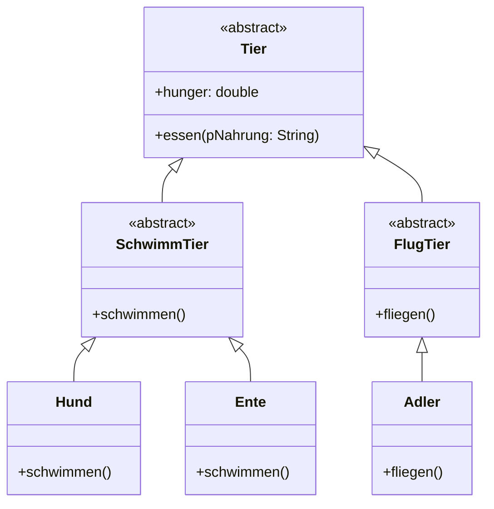
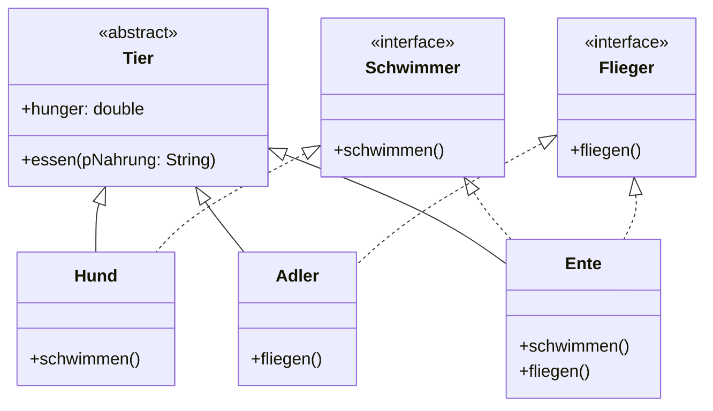
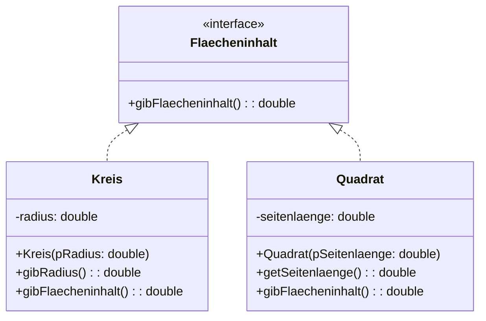

# Schnittstellen

In Schnittstellen (Interfaces) werden nur Methoden deklariert, aber nicht implementiert. Erst wenn eine Klasse diese Schnittstelle implementieren soll, muss die Methode auch implementiert werden. Dies verhält sich also ähnlich zu den abstrakten Klassen.

Aber im Gegensatz zu abstrakten Klassen kann eine Klasse mehr als eine Schnittstelle implementieren. Dadurch wird die Einfachvererbung wie sie in Java vorzufinden ist aufgeweicht.

Angenommen wir möchten verschiedene Tiere modellieren. Manche Tiere können schwimmen, machne können fliegen, manche können beides. Das heißt, dass wir mit einer einfachen Vererbungsstruktur dies nur schwer oder gar nicht umsetzten können.



Wenn wir uns das Implementationsdiagramm anschauen, dann stellen wir fest, dass Enten eigentlich auch Fliegen können. Das können wir mit einer Verebnungshierachie nur schwer umsetzten.

Aber eigentlich wollen wir auch nur festlegen welche Fähigkeiten `schwimmen` und `fliegen` die speziellen Tiere haben sollen. Daher bietet es sich hier an Schnittstellen zu verwenden.



Im Java Quelltext werden Schnittstellen wie folgt implementiert:

```java

public interface Schwimmer {
    public void schwimmen();
}

public interface Flieger {
    public void fliegen();
}

public class Ente implements Schwimmer, Flieger {
    public void schwimmen() {

    }

    public void fliegen() {

    }
}

```

Schnittstellen können ansonsten genau wie abstrakte Klassen im Quelltext verwendet werden. Das heißt, dass keine Objekte direkt von einer Schnittstelle erzeugt werden können, aber die Schnittstelle als Datentyp verwendet werden kann.

```java

Ente meineEnte = new Ente();
Schwimmer meinSchwimmer = new Ente();

Flieger meineFlieger[] = new Flieger[2];
meineFlieger[0] = new Ente();
meineFlieger[1] = new Adler();

```

## Aufgabe: Grafikanwendung

Das folgende Implementationsdiagramm ist gegeben



1. Beschreibe die Auswirkungen der Schnittstelle Flaecheninhalt auf die Klassen Kreis und Quadrat.
2. Erweitere das Implementationsdiagramm um die Schnittstelle Umfang.
3. Implementiere die Klassen Kreis und Quadrat und die beiden Schnittstellen Flaecheninhalt und Umfang.
4. Ergänze die for-Schleife in der datei Grafikanwendung.java so, dass der Flächeninhalt von allen Objekte im Array f berechnet wird. Befülle dazu das Array f.

:::onlineide

```java Grafikanwendung.java

Flaecheninhalt[] f = new Flaecheninhalt[2];

double a = 0;
for (int i = 0; i < f.length; i++) {

}

```

```java Kreis.java

```

```java Quadrat.java

```

```java Flaecheninhalt.java

```

:::
