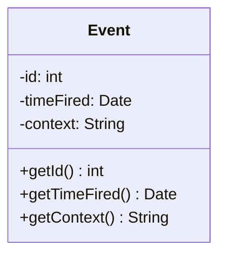
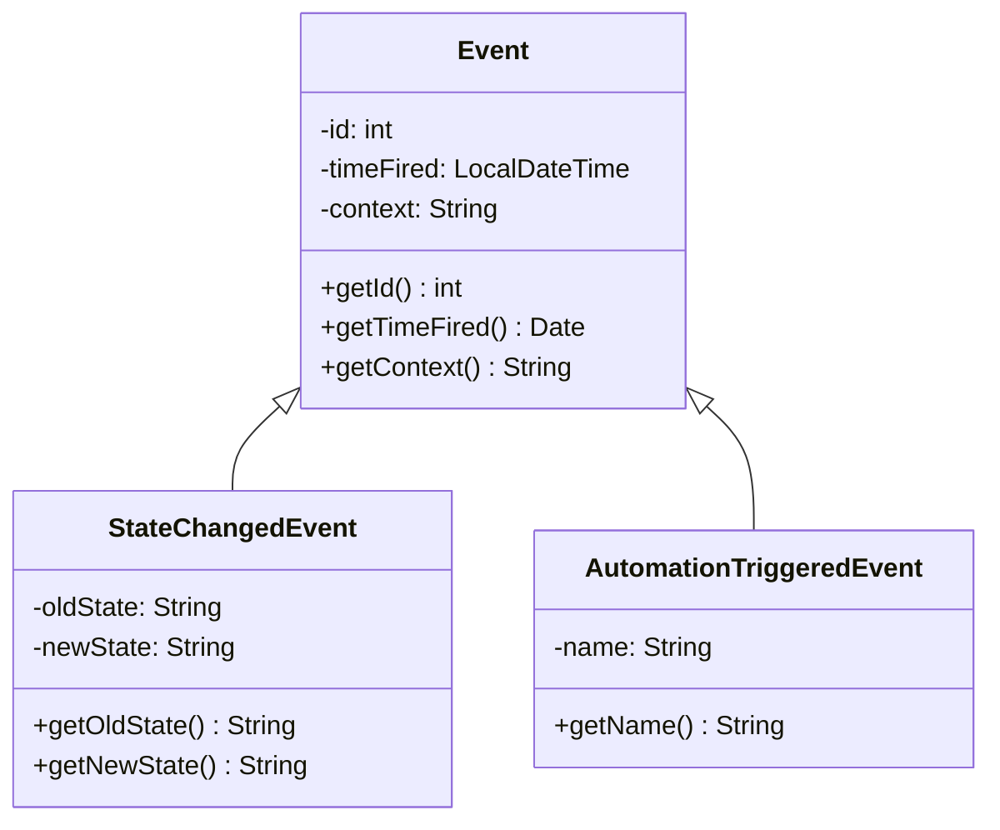

# Ereignisse

Ereignisse bilden die Basis von Home Assistant. Immer, wenn etwas passiert wird ein Ereignis ausgelöst. Jedes Ereignis hat eine eindeutige Id, einen Zeitstempel wann das Ereignis ausgelöst wurde und einen Kontext.

Eine Klasse die diese Ereignisse repräsentiert, könnte wie folgt aussehen.

Damit verschiedene Ereignisse verwaltet werden können, wird in Home Assistant zwischen verschiedenen Ereignistypen unterschieden. In der objektorientierten Programmierung können wir dies mit Unterklassen realisieren.

In unserem Fall haben wir zunächst zwei Spezialisierungen. Einaml das StateChangedEvent, welches zum Beispiel ausgeführt wird, wenn eine Lampe angeschaltet wird, und das AutomationTriggeredEvent, welches ausgeführt wird, wenn zum Beispiel die Automatisierung "Sonnenaufgang" ausgeführt wird.

## Aufgaben

1. Erstelle Objekdiagramme zu den folgenden Ereignissen:
    1. "23:12 Licht3 im Wohnzimmer angeschaltet."
    2. "10:15 TemperaturSensor3 im Schlafzimmer misst 21 °C."
    3. "14:10 Eingangstüre erkennt eine Bewegung."
    4. "15:30 Bundesliga"
2. Beschreibe welche Ereignisse durch die Automatisierung "Bundesliga" ausgelöst werden könnten.
3. Modelliere eine Klasse "TemperatureChangedEvent" in Anlehnung an die "StateChangedEvent" Klasse. Ergänze das Klassendiagramm.
3. Besuche erneut das [Beispieldashboard](https://demo.home-assistant.io/) und erstelle weitere Objektdiagramme zu den Ereignissen.
4. Reichen die Ereignisse? Schaue dir alle Demos an und überlege, ob weitere Spezialisierungen benötigt werden.
