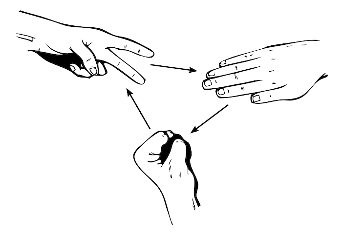

:::alert{info}
Diese Lernstrecke ist eine Abwandlung und Erweiterung der Lernstrecke von [inf-schule.de](https://inf-schule.de/kids/datennetze/binaerdarstellung).
:::

# Binärdarstellung von Information

-{width="200px"}

Ein Computer hat kein Gehirn wie wir Menschen. Trotzdem kann er Informationen speichern und verarbeiten. Damit er dies tun kann, müssen die Informationen in geeigneter Form dargestellt werden.

In diesem Kapitel wirst Du Spielergebnisse des Spiels "Schere, Stein, Papier" in einer Form darstellen, wie sie auch ein Computer verarbeiten kann. 

---

:::alert{info}
Hier lernst du,

- wie man mit zwei Zuständen Informationen darstellen kann.
- warum man in der Informatik oft die Zahlen 0 und 1 nutzt.
- auf welche Art man die Zahl 0 und 1 im Computer darstellen kann.
- die Bedeutung der Begriffe Bit und Byte kennen.
:::

## Voraussetzungen

Bei diesem Projekt handelt es sich um ein Einführungs-Projekt. Es sind keine Vorkenntnisse erforderlich - du kannst also sofort loslegen.

Wenn Du möchtest, kannst Du das Projekt [Daten und Codierungen im Alltag](../daten-und-codierung-im-alltag/00-einstieg) vor diesem Projekt bearbeiten. Dann werden dir die Inhalte hier noch leichter fallen. 
