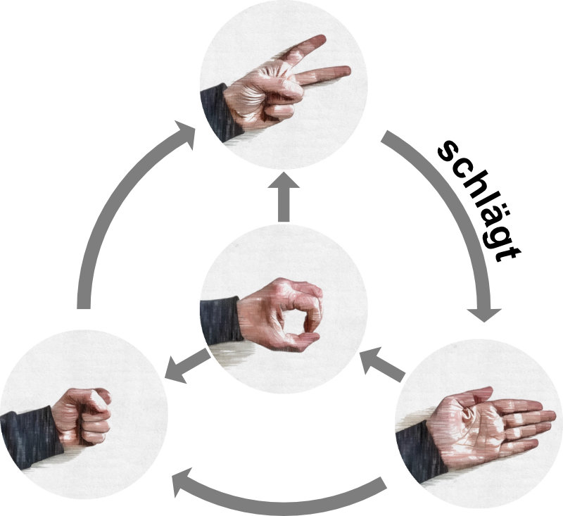

# Schere, Stein, Papier

Bestimmt kennst Du das Spiel "Schere, Stein, Papier" und wahrscheinlich hast du schon oft die Frage gehört: Mit Brunnen oder ohne?

Hier soll es um die Variante mit Brunnen gehen. Die Regeln sind in Kurzform noch einmal in der folgenden Grafik dargestellt: 

{width="400px"}
## Aufgabe 1

:::snippet{#aufgabe}
Durch die Erweiterung um Brunnen haben manche Symbole eine
höhere Gewinnchance als andere. Mache Dir anhand der Grafik
klar welche Symbole bessere und welche Symbole schlechtere
Gewinnchancen haben.

Schreibe deine Erkenntnisse auf.
:::

::textinput{placeholder="Hier deine Erkenntnisse eintragen..." height="100px"}

## Aufgabe 2

:::snippet{#aufgabe}
Wenn man gegen jemanden spielt, der die Symbole rein zufällig
auswählt, sollte man natürlich ein Symbol mit besseren
Gewinnchancen wählen. Allerdings kann ein menschlicher Gegner
nicht rein zufällig wählen, da er zumindest unbewusst
bestimmte Symbole und Reihenfolgen bevorzugt und außerdem auf
deine Entscheidungen reagieren kann.

**Spiele das Spiel mehrfach gegen jemand anderes oder gegen den Computer.** Gelingt es dir
dich auf die Strategie deines Gegners einzustellen? 
:::

<rock-paper-scissors id="rps-binaerdarstellung"></rock-paper-scissors>
