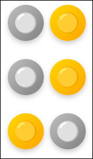

# Münzcode

Wir gehen als Beispiel davon aus, dass Anna und Bruno gegeneinander gespielt haben. Wahrscheinlich hast Du eine der beiden Varianten benutzt, um den Spielverlauf darzustellen:

**Variante 1**: Pro Runde wird eine Münze vergeben. Wenn Anna gewinnt, dann liegt die Zahl oben. Wenn Bruno gewinnt, liegt die Rückseite der Münze oben. (Das hätte man natürlich auch umgekehrt machen können.)

**Variante 2**: Anna und Bruno bekommen beide eine Münze. Der Spieler, der gewonnen hat, markiert das, indem er die Münze mit der Zahl nach oben legt. (Auch das hätte man natürlich umgekehrt machen können.)

Wenn Anna zweimal gewonnen hat und danach Bruno einmal gewonnen hat, ergibt sich folgende Darstellung: 

| Variante 1 | Variante 2 |
|------------|------------|
|  |  |

## Aufgabe

:::snippet{#aufgabe}
Die beiden Varianten stellen unterschiedliche Codierungen für die gleiche Information dar.

Entscheide begründet welche du bevorzugst.
:::

::textinput{placeholder="Hier deine Begründung eintragen..." height="200px"}
