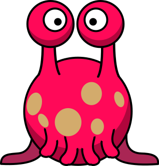

# Die ABABs 👽

## 🌟 Willkommen auf Planet ABAB!

Weit entfernt im Universum leben die ABABs - ein Alien-Volk mit einer ganz besonderen Sprache. Sie kennen nur zwei Buchstaben: **A** und **B**!

Die Einwohner haben Namen wie:
- ABAB
- BAAB  
- BABBA
- AABB

Du siehst hier den Chef der ABABs, der den stolzen Namen **BABBA** trägt: 

{width="150px"}

## 🤔 Denkst du mit!

Die ABABs haben nur zwei Buchstaben (A und B), genau wie Computer nur zwei Zeichen haben (0 und 1). Perfekt, um zu verstehen, wie Computer Buchstaben speichern!

## 💡 Eine einfache Idee

Wie könnten wir die Buchstaben A und B mit 0 und 1 darstellen?

:::collapsible{title="💭 Tipp: Eine mögliche Lösung"}
**Eine einfache Codierung:**
- A = 0
- B = 1

Dann würde BABBA so aussehen: **10110**

Aber es gibt auch andere Möglichkeiten! Du könntest auch sagen:
- A = 1  
- B = 0

Dann wäre BABBA: **01001**
:::

## 🎮 Aufgabe 1 - Werde zum Code-Erfinder!

:::snippet{#aufgabe}
**Deine Aufgabe:** Überlege dir, wie du die Namen der ABABs mit 0 und 1 darstellen kannst.

1. Entscheide: Welche Zahl soll für A stehen? Welche für B?
2. Codiere diese Namen:
   - **BABBA** (der Chef)
   - **ABAB** 
   - **BAAB**
3. Probiere es mit dem Werkzeug unten aus!
:::

**Dein Code-Werkzeug:**

<bit-rows id="binaercode-reihen-ababs"></bit-rows>

:::collapsible{title="🎯 Extra-Challenge für Profis"}
Kannst du deinen eigenen ABAB-Namen erfinden und ihn in 0 und 1 umwandeln? 

Beispiele: AABBA, BBBAA, ABABA
:::
