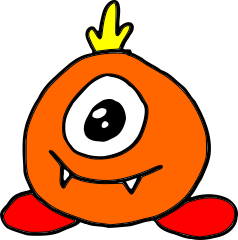

# Die AHs - Entdecker

Etwas näher an der Erde wohnen die AHs. Die Bewohner kennen die Buchstaben von A bis H. Die Einwohner heißen z.B. FEBE, CHABA und DEBAHA. Das hier ist z.B. Königin **FEBE**: 

{width="150px"}

## Aufgabe 1 - Mehr Buchstaben codieren

:::snippet{#aufgabe}
Vermutlich hast du die Namen der ABABs codiert, indem die 0 für das A stand und die 1 für das B (oder umgekehrt). Bei den AHs funktioniert dies nicht mehr ganz so leicht. Überlege dir eine Codierung für die Buchstaben A bis F. 
:::

::textinput{placeholder="Hier kannst du deine Codierung eintragen..." height="200px"}

## Aufgabe 2 - Namen der AHs codieren

:::snippet{#aufgabe}
Teste deine Codierung anhand der Namen **FEBE**, **CHABA** und **DEBAHA**. 
:::

<bit-rows id="binaercode-reihen-ahs"></bit-rows>

:::snippet{#aufgabe}
Überlege dir einen weiteren Namen, codiere ihn und gib ihn einem Mitschüler, der ihn decodieren soll. Falls es dabei Probleme gibt und dein Mitschüler nicht sicher entscheiden kann, welchen Namen du gemeint hast, musst du möglicherweise deine Codierung überarbeiten. 
:::

<bit-rows id="binaercode-reihen-ahs-2"></bit-rows>
