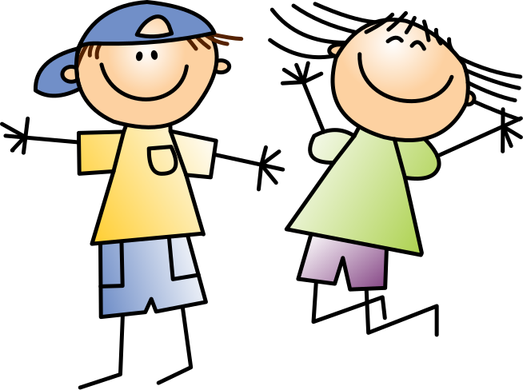

# Die Menschen

Das Volk der Menschen und deren Namen kennst du ja. Hier siehst du z.B. ANNA und BRUNO. 

{width="150px"}
## Aufgabe 1 - Wie viele Bits braucht man?

:::snippet{#aufgabe}
Um die Buchstaben von A bis Z zu codieren, benötigst du für einen Buchstaben mehr Bits als du für die ABABs und die AHs gebraucht hast. Mache dir klar wie viele unterschiedliche Zeichen du mit 1, 2, 3, ... Bits unterscheiden kannst. Wie viele Bits benötigst du also für 26 Buchstaben? 
:::

::textinput{placeholder="Hier kannst du deine Überlegungen eintragen..." height="50px"}

## Aufgabe 2 - Buchstaben codieren

:::snippet{#aufgabe}
Überlege dir eine Codierung für die Buchstaben von A bis Z und notiere sie. 
:::

::textinput{placeholder="Hier kannst du deine Codierung eintragen..." height="300px"}

## Aufgabe 3 - Namen der Menschen codieren

:::snippet{#aufgabe}
Teste deine Codierung für die Namen ANNA, BRUNO und z.B. deinen eigenen Namen. 
:::

<bit-rows id="binaercode-reihen-menschen"></bit-rows>
