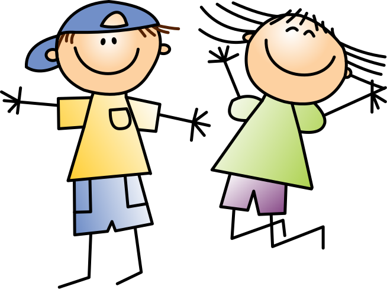

# Die Menschen 🌍

## Zurück auf der Erde!

Das Volk der Menschen und deren Namen kennst du ja. Hier siehst du z.B. **ANNA** und **BRUNO**. 

{width="150px"}

## 🧮 Die große Frage: Wie viele Bits brauchen wir?

Für die Menschen müssen wir die Buchstaben von **A bis Z** codieren - das sind **26 Buchstaben**!

:::alert{info}
**Was wir bisher gelernt haben:**
- 2 Buchstaben (ABABs) → 1 Bit (weil 2¹ = 2)
- 8 Buchstaben (AHs) → 3 Bits (weil 2³ = 8)
- 26 Buchstaben (Menschen) → ? Bits
:::

## 🎮 Aufgabe 1 - Finde heraus: Wie viele Bits?

:::snippet{#aufgabe}
**Deine Detektivarbeit:** Wie viele unterschiedliche Zeichen kannst du mit verschiedenen Bit-Zahlen darstellen?

Fülle die Tabelle aus:

| Anzahl Bits | Berechnung | Anzahl Zeichen |
|-------------|------------|----------------|
| 1 Bit       | 2¹         | 2              |
| 2 Bits      | 2²         | 4              |
| 3 Bits      | 2³         | 8              |
| 4 Bits      | 2⁴         | ?              |
| 5 Bits      | 2⁵         | ?              |
| 6 Bits      | 2⁶         | ?              |

**Frage:** Wie viele Bits brauchst du mindestens für 26 Buchstaben?
:::

::textinput{placeholder="Schreibe hier deine Antwort und deine Überlegungen..." height="100px"}

:::collapsible{title="💡 Hilfe"}
**Tipp:** Du brauchst mindestens so viele Bits, dass 2^Bits ≥ 26 ist.

- 4 Bits → 2⁴ = 16 Zeichen (zu wenig! ❌)
- 5 Bits → 2⁵ = 32 Zeichen (das reicht! ✅)
:::

## 🎨 Aufgabe 2 - Werde Code-Designer!

:::snippet{#aufgabe}
**Deine kreative Aufgabe:** Überlege dir eine eigene Codierung für die Buchstaben A bis Z!

**Beispiel für die ersten Buchstaben:**
- A = 00000
- B = 00001  
- C = 00010
- D = 00011
- ...

Du kannst aber auch eine ganz andere Reihenfolge wählen! Sei kreativ! 🎨
:::

::textinput{placeholder="Notiere hier deine Codierung für alle 26 Buchstaben..." height="300px"}

:::collapsible{title="💭 Beispiel-Codierung"}
Eine mögliche Codierung (es gibt viele!):

```
A = 00000    N = 01101
B = 00001    O = 01110
C = 00010    P = 01111
D = 00011    Q = 10000
E = 00100    R = 10001
F = 00101    S = 10010
G = 00110    T = 10011
H = 00111    U = 10100
I = 01000    V = 10101
J = 01001    W = 10110
K = 01010    X = 10111
L = 01011    Y = 11000
M = 01100    Z = 11001
```
:::

## 🎮 Aufgabe 3 - Test deinen Code!

:::snippet{#aufgabe}
**Jetzt wird's spannend:** Teste deine Codierung!

1. Codiere den Namen **ANNA**
2. Codiere den Namen **BRUNO**  
3. Codiere **deinen eigenen Namen**! 😊
4. **Extra:** Kannst du eine Geheimbotschaft an deine Freunde schreiben?
:::

**Dein Code-Werkzeug:**

<bit-rows id="binaercode-reihen-menschen"></bit-rows>

:::collapsible{title="🌟 Fun Fact"}
**Wusstest du?** Dein Name in Binärcode könnte so aussehen:

**ANNA** (mit der Beispiel-Codierung):
- A = 00000
- N = 01101
- N = 01101  
- A = 00000

Ergibt: `00000 01101 01101 00000` (20 Bits = 2,5 Bytes)
:::
