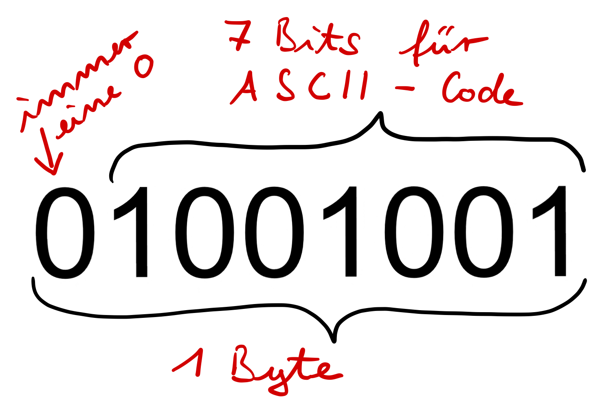

# ASCII

So wie du dir eine Zeichencodierung überlegt hast, haben das auch viele andere schon getan. Besonders verbreitet ist die sogenannte ASCII-Codierung. Die Abkürzung steht für "American Standard Code for Information Interchange" und wird einfach als "ASCI" ausgesprochen.

Üblicherweise werden Daten in Einheiten von 1 Byte, also 8 Bit gespeichert. Da man von diesem Byte ein Bit reservieren wollte, um z.B. Fehler bei der Übertragung von Daten erkennen zu können, nutzt der ASCII-Code 7 Bits. Meistens nutzt man trotzdem ein Byte pro Zeichen und schreibt am Anfang eine 0, gefolgt von den eigentlichen 7 Bits des ASCII-Codes. 

{width="400px"}
## Aufgabe 1 - Anzahl der Zeichen

:::snippet{#aufgabe}
Berechne die Anzahl der Zeichen, die man mit 7 Bits unterscheiden kann.
:::

:::multievent
Die Anzahl der Zeichen beträgt {z{128}}.
:::

:::collapsible{title="Hilfe"}
Mit n Bits kann man 2^n verschiedene Zeichen codieren.

Also mit 3 Bits 2^3 = 8 Zeichen, mit 4 Bits 2^4 = 16 Zeichen, mit 5 Bits 2^5 = 32 Zeichen, mit 6 Bits 2^6 = 64 Zeichen und mit 7 Bits?
:::

## Die ASCII-Tabelle

Die ASCII-Tabelle ordnet jedem Zeichen eine Zahl zu. Diese Zahl wird dann in Binärform als 7-Bit-Folge gespeichert. Hier siehst du einen Ausschnitt der ASCII-Tabelle:

| Zeichen | Binärcode  |
|---------|---------|
| A       | 01000001 |
| B       | 01000010 |
| C       | 01000011 |
| a       | 01100001 |
| b       | 01100010 |
| c       | 01100011 |
| 0       | 00110000 |
| 1       | 00110001 |
| 2       | 00110010 |
| Space   | 00100000 |
| !       | 00100001 |

## Aufgabe 2 - Zeichen erkennen

::::multievent
:::snippet{#aufgabe}
Du bist der Computer uns muss folgende Binärcodes in Zeichen umwandeln. Benutze dafür den Umwandler weiter unten.

- 01000001: {T{A}}
- 01100010: {T{b}}
- 00110010: {T{2}}
- 00111111: {T{$}}
:::
::::

<binary-to-ascii id="binaercode-reihen-ascii-umwandeln"></binary-to-ascii>

## Aufgabe 3 - Codieren mit ASCII

:::snippet{#aufgabe}
Ändere den Binärcode so ab, dass die Zeichen B,C,D ... erscheinen. Probiere danach auch die Kleinbuchstaben a,b,c ... und die Ziffern 0,1,2 ... aus.
:::

<binary-to-ascii id="binaercode-reihen-ascii"></binary-to-ascii>
