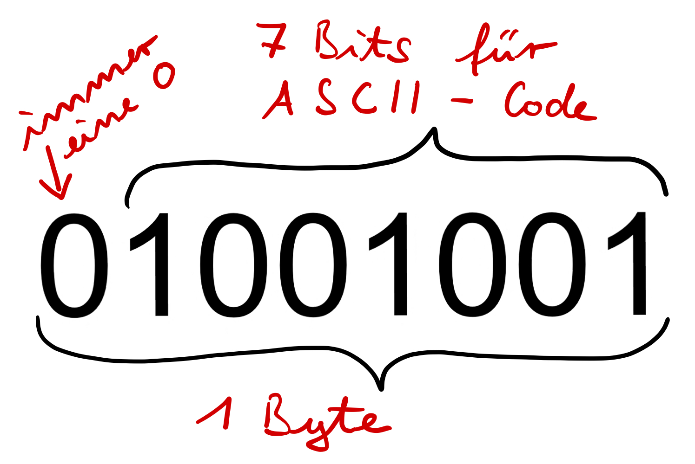

# ASCII - Der Universal-Code 🌐

## 📱 Die echte Lösung aus der Computerwelt

Super! Du hast dir eine eigene Codierung überlegt. Aber stell dir vor: Jeder würde seine eigene Codierung erfinden! 😱 

**Das Problem:** Dein Computer könnte die Nachricht von meinem Computer nicht lesen!

**Die Lösung:** Alle einigen sich auf **einen gemeinsamen Code** - den **ASCII-Code**!

:::alert{info}
**ASCII** steht für "American Standard Code for Information Interchange"  
**Ausgesprochen:** "Aski"  
**Bedeutet:** Ein Standard, damit alle Computer die gleiche "Sprache" sprechen! 🗣️
:::

## 🔢 Wie funktioniert ASCII?

ASCII nutzt **7 Bits** pro Zeichen (manchmal wird eine 0 vorne hinzugefügt, dann sind es 8 Bits = 1 Byte). 

{width="400px"}

## 🧮 Aufgabe 1 - Rechne mit!

:::snippet{#aufgabe}
**Quiz-Zeit!** Wie viele verschiedene Zeichen kann man mit 7 Bits darstellen?

**Rechne:** 2 × 2 × 2 × 2 × 2 × 2 × 2 = 2⁷ = ?
:::

:::multievent
Die Anzahl der Zeichen beträgt {z{128}}.
:::

:::collapsible{title="💡 Hilfe - Schritt für Schritt"}
**Erinnerst du dich?**
- 3 Bits → 2³ = 8 Zeichen  
- 4 Bits → 2⁴ = 16 Zeichen
- 5 Bits → 2⁵ = 32 Zeichen  
- 6 Bits → 2⁶ = 64 Zeichen
- 7 Bits → 2⁷ = ?

**Tipp:** 2⁷ = 2 × 2 × 2 × 2 × 2 × 2 × 2 = 128
:::

**Das bedeutet:** Mit ASCII kann man 128 verschiedene Zeichen darstellen! Das reicht für:
- Alle Großbuchstaben (A-Z)
- Alle Kleinbuchstaben (a-z)  
- Alle Ziffern (0-9)
- Sonderzeichen (!@#$%... und viele mehr)

## Die ASCII-Tabelle

Die ASCII-Tabelle ordnet jedem Zeichen eine Zahl zu. Diese Zahl wird dann in Binärform als 7-Bit-Folge gespeichert. Hier siehst du einen Ausschnitt der ASCII-Tabelle:

| Zeichen | Binärcode  |
|---------|---------|
| A       | 01000001 |
| B       | 01000010 |
| C       | 01000011 |
| a       | 01100001 |
| b       | 01100010 |
| c       | 01100011 |
| 0       | 00110000 |
| 1       | 00110001 |
| 2       | 00110010 |
| Space   | 00100000 |
| !       | 00100001 |

## 🎮 Aufgabe 2 - Werde zum Computer-Decoder!

::::multievent
:::snippet{#aufgabe}
**Deine Mission:** Du bist jetzt der Computer! 🤖 Dekodiere diese Binärcodes mit dem Umwandler unten.

**Geheime Codes:**
- 01000001 = {T{A}} (Erster Buchstabe des Alphabets)
- 01100010 = {T{b}} (Kleiner Buchstabe!)  
- 00110010 = {T{2}} (Eine Zahl!)
- 00111111 = {T{?}} (Ein Fragezeichen... oder?)

**Tipp:** Nutze den Umwandler, um die Codes zu entschlüsseln! 🔍
:::
::::

**Dein Decoder-Werkzeug:**

<binary-to-ascii id="binaercode-reihen-ascii-umwandeln"></binary-to-ascii>

:::collapsible{title="🎯 Extra-Challenge"}
**Kannst du diese Geheimbotschaft entschlüsseln?**

01001000 01101001 = ?

(Tipp: Es sind zwei Buchstaben... zusammen ergeben sie eine Begrüßung! 👋)
:::

## 🎨 Aufgabe 3 - Werde zum Code-Künstler!

:::snippet{#aufgabe}
**Experimentiere mit ASCII!** Ändere die Nullen und Einsen und beobachte, was passiert.

**Challenges:**
1. 🔤 Ändere den Code so, dass **B, C, D, E** erscheinen
2. 🔡 Probiere Kleinbuchstaben: **a, b, c, d**
3. 🔢 Teste Ziffern: **0, 1, 2, 3**  
4. 🎭 Finde Sonderzeichen: **! ? @ #**
5. 🌟 **Profi-Level:** Schreibe deinen Namen in ASCII!
:::

**Dein Experimentier-Labor:**

<binary-to-ascii id="binaercode-reihen-ascii"></binary-to-ascii>

:::alert{success}
**💡 Beobachtung:** Siehst du ein Muster? 
- Großbuchstaben beginnen meist mit `010...`
- Kleinbuchstaben beginnen meist mit `011...`  
- Ziffern beginnen meist mit `0011...`
:::

:::collapsible{title="📊 Fun Facts über ASCII"}
**Wusstest du?**
- 🆎 Großbuchstaben und Kleinbuchstaben unterscheiden sich nur in einem Bit!
- 📱 Eine SMS mit 160 Zeichen braucht 160 × 8 = 1280 Bits = 160 Bytes
- 🎮 Alte Computer-Spiele nutzten ASCII-Zeichen für Grafiken!
:::
