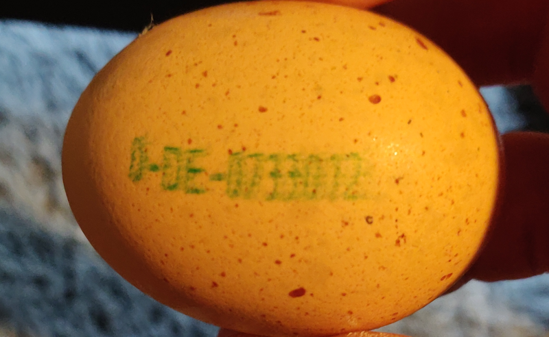
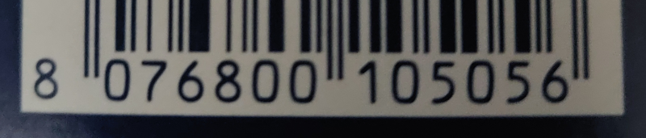
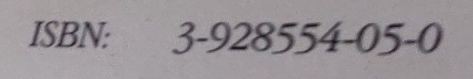

# Ach du dickes Ei!

## Codierung von Lebensmitteln

-{width="300px"}

Auf vielen Verpackungen von Lebensmitteln finden sich Codierungen, die Informationen über das Produkt enthalten. Bei Eiern sind diese Daten direkt auf die Schale gedruckt! Im Bild sieht man beispielsweise die Zeichenfolge 0-DE-0733012. 

## Aufgabe 1 - Woher stammt das Ei?

:::snippet{#aufgabe}
Recherchiere mit einer [Suchmaschine für Kinder](https://www.fragfinn.de/) nach dem Begriff "Eiercode" und finde möglichst viele Informationen über das abgebildete Ei heraus.

Beantworte dabei folgende Fragen:
:::

:::multievent
Die erste Ziffer steht für {A{!die Haltungsform|das Herkunftsland|den Erzeugerbetrieb}} des Huhns.

Die beiden Buchstaben DE stehen für {A{die Haltungsform|!das Herkunftsland|den Erzeugerbetrieb}} des Huhns.

Ein Ei aus Österreich hätte an dieser Stelle {A{!AT|DE|CH}} gestanden.
:::

## Aufgabe 2 - Pasta, Käse oder Brot?

-{width="300px"}

:::snippet{#aufgabe}
Auf den meisten Lebensmittel-Verpackungen findet man die 13-stellige europäische Artikelnummer (EAN13). 

Finde mit Hilfe der [EAN-Suchmaschine](https://www.ean-suche.de) heraus zu welchem Produkt dieser Barcode gehört.
:::

:::multievent
Der Barcode gehört zu {A{!Pasta|Käse|Brot}}.
:::

## Aufgabe 3 - ISBN

-{width="300px"}

:::snippet{#aufgabe}
Dieses Bild zeigt ebenfalls eine sehr gebräuchliche Codierung. Weitere Beispiele dafür finden sich sicherlich auch in deinem Schulranzen. Um was handelt es sich hierbei?

Finde mit der [ISBN-Suchmaschine](https://www.isbn.de/) heraus, zu welchem Buch dieser Code gehört.
:::

:::multievent
Bei diesem Code handelt es sich um eine {A{!ISBN|EAN|QR-Code}}.

Das Buch mit dieser ISBN hat den Titel {A{Harry Potter und der Stein der Weisen|Mathematik Klasse 6|!Das Fünf Elemente Kochbuch|Java für Dummies}}.
:::
