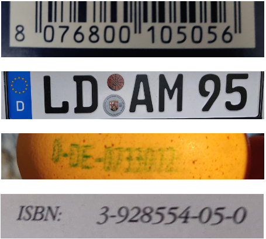

# Daten und Codierung im Alltag

:::alert{info}
Diese Lernstrecke ist eine Abwandlung und Erweiterung der Lernstrecke von [inf-schule.de](https://inf-schule.de/kids/datennetze/daten-im-alltag).
:::

## Wer versteht denn sowas?

-

In unserem Alltag begegnen uns immer wieder Daten in Form von Ziffern und Zeichen, deren Bedeutung nicht sofort zu erkennen ist.

Verstehst du, welche Information in den Daten dieser Abbildungen steckt? Oder kannst du wenigstens sagen, um was es dabei geht?

Wenn nicht - nicht weiter schlimm: in der folgenden Lernstrecke wollen wir uns Daten und Codierungen genauer anschauen...
