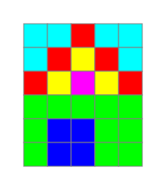

# Villa Kunterbund

Hier siehst du ein Bild der Villa Kunterbunt und die dazugehörigen Zahlen.

Jedes Kästen wird aus einer Zahlenkombination aus drei Ziffern zwischen 0 und 1 dargestellt: Zum Beispiel das Kästchen ganz links oben wird codiert mit 1 1 1.

<pixel-editor id="pbm-editor-haus-bunt" readOnly>
P3
5 6
1
---
1 1 1   1 1 1   1 0 0   1 1 1   1 1 1
1 1 1   1 0 0   1 0 0   1 0 0   1 1 1
1 0 0   1 0 0   1 0 0   1 0 0   1 0 0
0 1 0   0 1 0   0 1 0   0 1 0   0 1 0
0 1 0   0 0 1   0 0 1   0 1 0   0 1 0
0 1 0   0 0 1   0 0 1   0 1 0   0 1 0
</pixel-editor>

## Aufgabe 1

::embed{src="https://learningapps.org/show.php?id=p5901p2u320"}

## Aufgabe 2

:::snippet{#aufgabe}
Veränder die Villa Kunterbunt so, dass sie aussieht, wie auf diesem Bild:

:::

<pixel-editor id="pbm-editor-haus-rgb-mirror" readOnly>
P3
5 6
1
---
1 1 1   1 1 1   1 0 0   1 1 1   1 1 1
1 1 1   1 0 0   1 0 0   1 0 0   1 1 1
1 0 0   1 0 0   1 0 0   1 0 0   1 0 0
0 1 0   0 1 0   0 1 0   0 1 0   0 1 0
0 1 0   0 0 1   0 0 1   0 1 0   0 1 0
0 1 0   0 0 1   0 0 1   0 1 0   0 1 0
</pixel-editor>