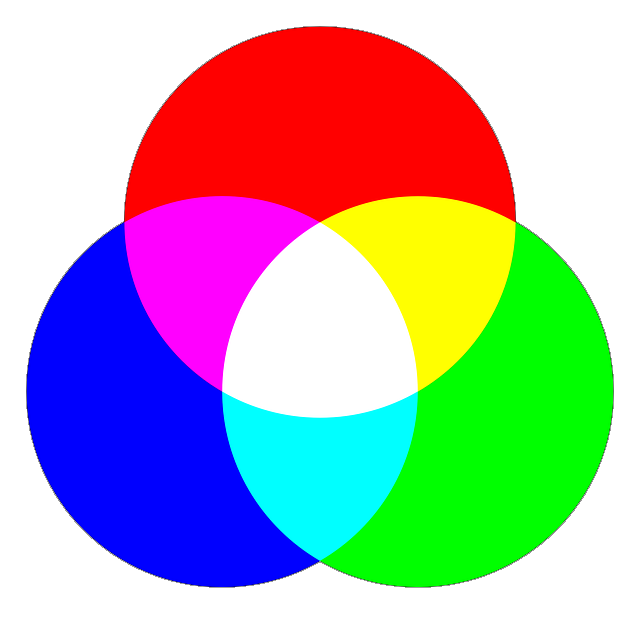

# Das PPM-Format

:::snippet{#merken}
Das PPM-Format ("Portable Pixmap") wird benutzt, um bunte Bilder (RGB-Bilder - RGB = Rot Grün Blau) darzustellen.

Der Kopf eines PPM-Dokuments beginnt mit P3 (für das Format PPM), gefolgt von der Spalten- und Zeilenanzahl (hier 5 und 6).

```
P3
5 6
1
```

Bei dem PPM Dokument wurde der Kopf um eine weitere Zeile erweitert: Der Maximalwert für die Helligkeit (hier die Zahl 1 aus der dritten Zeile).

Ein Pixel (Kästchen) wird bei dem PPM-Format mit einem "Dreierpäckchen" aus drei Ziffern dargestellt - die erste Ziffer entspricht dem Rotanteil, die zweite dem Grünanteil und die dritte dem Blauanteil, zum Beispiel:

-{width="200px"}

- 1 0 0 = Rot
- 0 1 0 = Grün
- 0 0 1 = Blau
- 0 0 0 = Schwarz
- 1 1 1 = Weiß
- 1 1 0 = Mischung aus Rot und Grün = Gelb
- 1 0 1 = Mischung aus Rot und Blau = Rosa (Magenta)
- 0 1 1 = Mischung aus Grün und Blau = Hellblau (Cyan)
:::

## Aufgabe 1

Verändere das Bild der Ente so, dass der Körper gelb, der Schnabel rot und das Auge schwarz ist. Speichere es unter einem passenden Namen ab.

:::collapsible{title="Tipp"}
Du musst in jedem "Dreierpäckchen" immer nur eine Zahl verändern.
:::

<pixel-editor id="ppm-editor-ente-rgb" readOnly>
P3
9 6
1
1 1 1   1 1 1   1 1 1   1 1 1   0 1 0   0 1 0   0 1 0   1 1 1   1 1 1
1 1 1   1 1 1   1 1 1   0 1 0   0 1 0   0 1 0   0 1 0   0 1 0   1 1 1
1 1 1   1 1 1   1 0 1   0 1 0   1 0 0   0 1 0   0 1 0   0 1 0   0 1 0
1 0 1   1 0 1   1 0 1   0 1 0   0 1 0   0 1 0   0 1 0   0 1 0   0 1 0
1 1 1   1 0 1   1 0 1   0 1 0   0 1 0   0 1 0   0 1 0   0 1 0   0 1 0
1 1 1   1 1 1   1 1 1   1 1 1   0 1 0   0 1 0   0 1 0   0 1 0   1 1 1
</pixel-editor>

## Aufgabe 2

:::snippet{#aufgabe}
Verändere den Maximalwert der Helligkeit (1 in der dritten Zeile) in die Zahl 2. Jetzt kann man noch mehr Farben darstellen, wie zum Beispiel orange. Findest du noch mehr Farben? 
:::

<pixel-editor id="ppm-editor-ente-rgb-more" readOnly>
P3
9 6
1
1 1 1   1 1 1   1 1 1   1 1 1   0 1 0   0 1 0   0 1 0   1 1 1   1 1 1
1 1 1   1 1 1   1 1 1   0 1 0   0 1 0   0 1 0   0 1 0   0 1 0   1 1 1
1 1 1   1 1 1   1 0 1   0 1 0   1 0 0   0 1 0   0 1 0   0 1 0   0 1 0
1 0 1   1 0 1   1 0 1   0 1 0   0 1 0   0 1 0   0 1 0   0 1 0   0 1 0
1 1 1   1 0 1   1 0 1   0 1 0   0 1 0   0 1 0   0 1 0   0 1 0   0 1 0
1 1 1   1 1 1   1 1 1   1 1 1   0 1 0   0 1 0   0 1 0   0 1 0   1 1 1
</pixel-editor>

:::collapsible{title="Tipp"}
In jedem "Dreierpäckchen" können nun die Ziffern 0, 1 und 2 verwendet werden, teste zum Beispiel 2 0 2.
:::