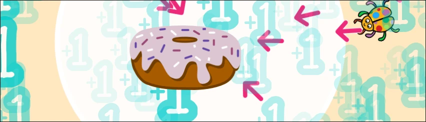

# Spieletest: Donut Klicker

Beim Donut-Klicker-Spiel musst du so viele Klicks wie möglich sammeln. Du kannst dir auch kleiner Helfer kaufen. Aber nehme dich vor dem Blitz in Acht!

Hier kannst du Varianten des Donut-Klicker Spiels ausprobieren und testen.

### Donut-Klicker v0
:::protect{password="dda" description="Erfrage das Passwort bei deiner Lehrkraft."}
Probiere den Donut-Klicker aus! 

- Beschreibe wie das Spiel funktioniert.
- Mache Verbesserungsvorschläge.

::embed{src="https://scratch.mit.edu/projects/1127440649/embed" height="calc(100vh - 120px)"}
:::

### Donut-Klicker v1
:::protect{password="dkd" description="Erfrage das Passwort bei deiner Lehrkraft."}
Probiere den Donut-Klicker v1 aus! Was ist neu im Vergleich zur vorherigen Version?

- Beschreibe die Veränderungen zu v0.
- Beschreibe wie du ein Klickerspiel gestalten würdest.

::embed{src="https://scratch.mit.edu/projects/1120631603/embed" height="calc(100vh - 120px)"}
:::

### Dein Donut-Klicker 
:::protect{password="ddd" description="Erfrage das Passwort bei deiner Lehrkraft."}
Jetzt bist du dran! Versuche deine eigenen Ideen umzusetzen.

Lade dir das Projekt herunter und bearbeite es in Scratch:

Du kannst zum Beispiel folgende Dinge verändern:

- Das Aussehen der Donuts
- Die Schnelligkeit des roten Pfeils
- Den Blitz entfernen

::download[Donut-Klicker.sb3]{src="./Donut-Klicker.sb3"}

:::
