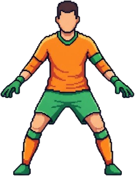
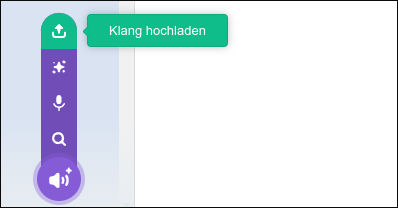

# Elfmeterschießen

Beim Elfmeterschießen-Spiel musst du den Ball ins Tor schießen, ohne dass der Torwart ihn hält. Wenn der Ball das Netz berührt, also die dunkelblaue Fläche, dann bekommst du einen Punkt.

::embed{src="https://scratch.mit.edu/projects/1136017940/embed"  height="calc(100vh - 120px)"}

## Scratch-Projekt

Hier kannst du das Projekt herunterladen.

::download[Elfmeterschießen.sb3]{src="./elfmeterschiessen.sb3"}

## Tipp und Tricks

:::collapsible{title="Echte Spielerbilder verwenden"}

Du kannst echte Bilder von Spielern verwenden, um dein Spiel realistischer zu
gestalten. Suche im Internet nach Bildern von Fußballspielern, die du verwenden
darfst, und füge sie in dein Scratch-Projekt ein. 

Klicke dazu auf die Figur "Katzen-Torwart" und dann auf "Kostüme". Dort kannst
du ein neues Kostüm hinzufügen, indem du ein Bild von deinem Computer
hochlädst. 

Achte darauf, dass das Bild eine transparente Hintergrundfarbe hat oder du das
Radiergummi-Werkzeug in Scratch verwendest, um den Hintergrund zu entfernen,
damit es gut aussieht, wenn es im Spiel verwendet wird.

Du kannst z.B. dieser Bilder verwenden, indem du mit der rechten Maustaste auf
das Bild klickst, "Grafik speichern unter..." auswählst. Es speicherst und
lädst es dann in dein Scratch-Projekt.

:::

::::collapsible{title="Fangesänge verwenden"}

Du kannst auch Fangesänge oder andere Soundeffekte in dein Spiel einbauen, um
es noch spannender zu machen. Suche im Internet nach lizenzfreien Soundeffekten
oder Fangesängen, die du verwenden darfst, und lade sie in dein Scratch-Projekt
hoch.

Klicke dazu auf die Figur "Katze" oder auf die Bühne und dann auf "Klänge". Dort kannst
du einen neuen Sound hinzufügen, indem du eine Audiodatei von deinem Computer
hochlädst.

https://freesound.org

Hier kannst du kostenlose Soundeffekte herunterladen.

Zum Beispiel [Stadiongeräusche](https://freesound.org/search/?q=stadium&f=type%253A%2522mp3%2522&s=Automatic+by+relevance&si_tags=0&si_name=0&si_description=0&si_packname=0&si_sound_id=0&si_username=0&d0=0&d1=*&ig=0&r=0&g=1&dp=0&cm=0&mm=0).

:::protect{password="fvs" description="Accountdaten für Freesound.org"}

Benutzername: studentshare
Passwort: Zookeeper4

:::

::::
