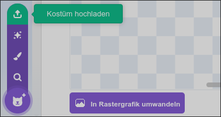

# Labyrinth

Beim Labyrinth muss du den Ausgang finden, ohne die Wände zu berühren. Wenn du die Wände berührst, wirst du zurückgesetzt. Du kannst dich mit den Pfeiltasten bewegen.

::blockflow-player{src="./labyrinth.sb3"}

## Scratch-Projekt

Hier kannst du das Projekt herunterladen.

::download[Labyrinth.sb3]{src="./labyrinth.sb3"}

## Tipp und Tricks

:::collapsible{title="Weitere Level hinzufügen"}

Jedes Kostüm in der Figur Level ist ein Level. Du kannst
weitere Kostüme hinzufügen, um mehr Level zu erstellen. So kannst du auch neue
Stacheln hinzufügen. Jedes Kostüm der Stacheln gehört zu einem Level.

:::

:::collapsible{title="Hintergrund ändern"}

Du kannst den Hintergrund ändern, um dein Labyrinth interessanter zu gestalten.
Klicke auf die Bühne und wähle einen neuen Hintergrund aus.

:::

:::collapsible{title="Kostüm des Balls ändern"}

Du kannst das Kostüm des Balls ändern, um ihn einzigartig zu machen. Klicke auf
die Figur Ball und wähle ein neues Kostüm aus.

:::
