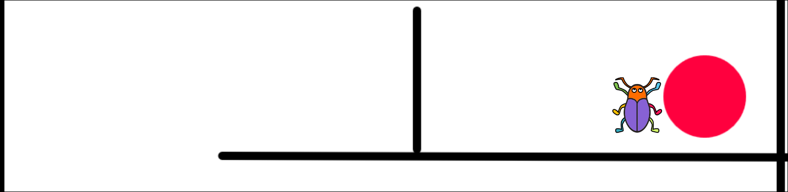

# Spieletest: Labyrinth

Beim Labyrinth-Spiel muss der Käfer den Ausgang finden ohne dabei die Wände zu berühren.

Wie schnell kannst du den Ausgang erreichen?

## Fehler finden

:::protect{password="lbh" description="Erfrage das Passwort bei deiner Lehrkraft."}
Der Käfer wird über die Pfeiltasten der Tastatur gesteuert. Wenn der Käfer den schwarzen Rand berührt, wird er zurückgesetzt. Wenn er den roten Punkt berührt, hast du gewonnen.

Es befinden sich drei Fehler im Spiel. Kannst du sie finden?

::embed{src="https://scratch.mit.edu/projects/1132848904/embed" height="calc(100vh - 120px)"}
:::

## Das Spiel verbessern

::::protect{password="lbd" description="Erfrage das Passwort bei deiner Lehrkraft."}
Jetzt bist du dran! Versuche folgende Dinge zu verändern:

- Der Käfer soll sich auch nach links bewegen können.
- Der Käfer soll nicht durch die Wände hingehen können.
- Wenn man alle Leben verloren hat, soll etwas passieren.

::download[Labyrinth-v0.sb3]{src="./Labyrinth-v0.sb3"}
::::

## Das Spiel erweitern

:::::protect{password="lbe" description="Erfrage das Passwort bei deiner Lehrkraft."}

Erweitere das Labyrinth-Spiel mit eigenen Ideen! Hier sind einige Vorschläge:

- Füge mehr Level hinzu, indem du ein neues Bühnen-Hintergrundbild erstellst.

:::collapsible{title="Tipp: So erstellst du ein neues Level"}
1. Klicke auf die Bühne und dann auf das Reiter "Hintergrundbilder".
2. Klicke auf das Malen-Symbol, um einen neuen Hintergrund zu erstellen.
3. Zeichne ein neues Labyrinth. Nutze schwarze Linien für die Wände und einen roten Punkt für den Ausgang.
:::

- Füge Hindernisse hinzu, die sich bewegen.
:::collapsible{title="Tipp: So fügst du bewegte Hindernisse hinzu"}
1. Erstelle ein neues Sprite für das Hindernis.
2. Nutze Blöcke wie "Gehe zu x: y:" und "Bewege dich 10 Schritte", um das Hindernis zu bewegen.
3. Füge eine Schleife hinzu, damit das Hindernis immer wieder zurückkehrt.
4. Das Hindernis sollte eine schwarze Farbe haben, damit der Käfer zurückgesetzt wird, wenn er es berührt.
:::

- Füge Klänge hinzu, wenn der Käfer sich bewegt oder gewinnt.
:::collapsible{title="Tipp: So fügst du Klänge hinzu"}
1. Klicke auf das Käfer-Sprite und dann auf den Reiter "Klänge".
2. Klicke auf das Lautsprecher-Symbol, um einen neuen Klang hinzuzufügen.
3. Wähle einen Klang aus der Bibliothek oder nimm deinen eigenen Klang auf.
4. Nutze den Block "Starte Klang [Klangname]", um den Klang abzuspielen, wenn der Käfer sich bewegt oder gewinnt.
:::

Benutze entweder dein aktuelles Projekt oder lade dir hier die fehlerfreie Version herunter:

::download[Labyrinth-v1.sb3]{src="./Labyrinth-v1.sb3"}
:::::

