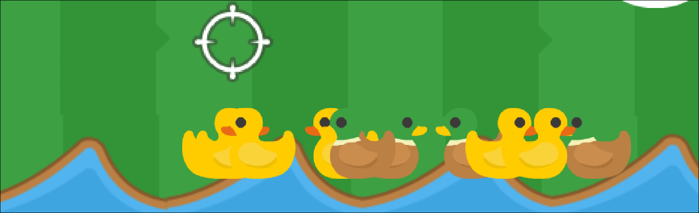

# Schießbude

Beim Schießbudenspiel muss du innerhalb kürzester Zeit so viele Punkte wie möglich sammeln.

## Ausprobieren

:::protect{password="sbe" description="Erfrage das Passwort bei deiner Lehrkraft."}
Finde heraus, wie die Schießbude funktioniert und probiere sie aus!

::embed{src="https://scratch.mit.edu/projects/1129520557/embed" height="calc(100vh - 120px)"}
:::

## Das Spiel verbessern

:::protect{password="sbd" description="Erfrage das Passwort bei deiner Lehrkraft."}

Jetzt bist du dran! Versuche folgende Dinge zu verändern:

- Das Spiel soll länger als 20 Sekunden dauern.
- Die Zielscheibe soll sich langsamer bewegen.
- Eine gelbe Ente soll 2 Punkte bringen.
- Verändere die Bewertung am Ende des Spiels.
- Es soll einen Cooldown für das Schießen geben. Das heißt, dass man z.B. 1 Sekunde warten muss zwischen den Schüssen.

Lade dir das Projekt herunter und bearbeite es in Scratch:

::download[Schießbude.sb3]{src="./Schießbude.sb3"}

:::
