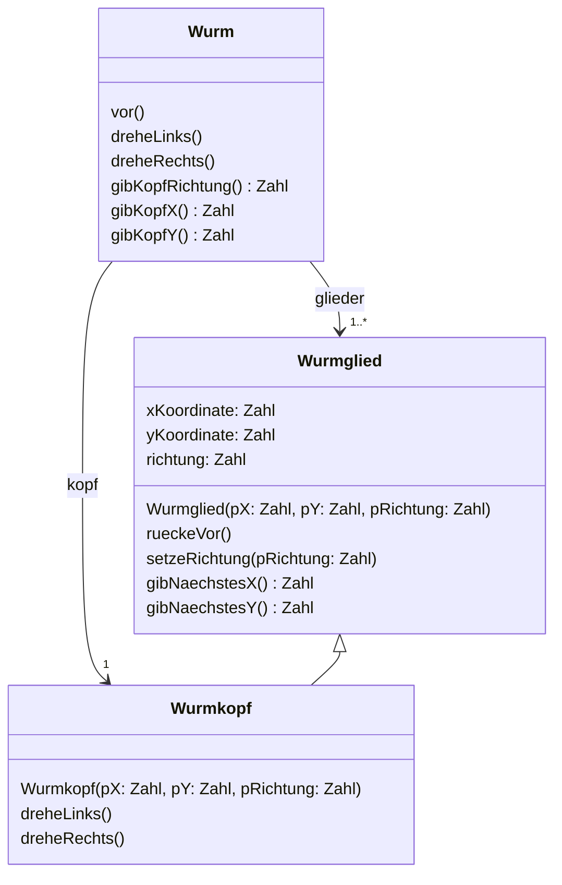
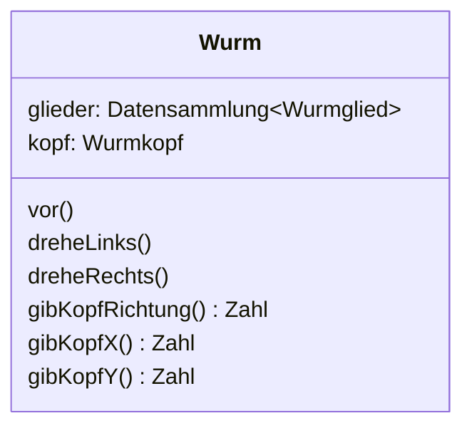

# Entwurfsdiagramm

Ein **Entwurfsdiagramm** (englisch *design class diagram*) ist ein :t[Klassendiagramm]{#klassendiagramm} aus der **frühen** Modellierungsphase. Es beantwortet die Frage *Woraus besteht das System?* und ist bewusst **programmiersprachenunabhängig**.

Die Notation folgt den Vorgaben für das Zentralabitur in Nordrhein-Westfalen.

## Was hineingehört

- Klassen mit ihren Beziehungen: gerichtete **Assoziation** und **Vererbung**.
- **Multiplizitäten** an den Assoziationen.
- Gegebenenfalls die **wesentlichen** Attribute und Methoden – nicht zwingend alle.

## Was anders ist als im Implementationsdiagramm

:::snippet{#merken}
| | Entwurfsdiagramm | :t[Implementationsdiagramm]{#implementationsdiagramm} |
| --- | --- | --- |
| Sichtbarkeit `+` `-` `#` | **keine** | ja |
| Datentypen | `Zahl`, `Text`, `Wahrheitswert`, `Datensammlung<…>` | die der Programmiersprache |
| Multiplizitäten | ja | nein – stattdessen konkrete Bezeichner |
| Rückgabetyp | ja, hinter dem Doppelpunkt | ja |

Es gibt **nur diese vier** Datentypen. Bei der Datensammlung steht in spitzen Klammern der Typ oder die Klasse der Elemente, die dort verwaltet werden.
:::

Multiplizitäten werden so geschrieben:

| | Bedeutung |
| --- | --- |
| `1` | genau ein assoziiertes Objekt |
| `0..1` | kein oder ein assoziiertes Objekt |
| `0..*` | beliebig viele assoziierte Objekte |
| `1..*` | mindestens ein, beliebig viele assoziierte Objekte |

## Zwei gleichwertige Darstellungen

Eine Assoziation darf man **entweder** als Attribut in den Klassenkasten schreiben **oder** als Pfeil zeichnen. Beides drückt denselben Sachverhalt aus.

**Mit Assoziationspfeilen** – der Bezeichner steht am Pfeil, die Multiplizität am Ziel:

**Ohne Assoziationspfeile** – dieselbe Aussage, die Beziehungen stehen als Attribute in der Klasse `Wurm`:

<!-- Mermaid-Notation, nur fuer Autorinnen und Autoren:
     Rueckgabetyp OHNE Doppelpunkt anhaengen (`gibKopfX() Zahl`) - Mermaid setzt das ` : ` selbst.
     Mit Doppelpunkt geschrieben rendert es `gibKopfX() : : Zahl`.
     Attribute und Parameter dagegen mit Doppelpunkt, die gibt Mermaid woertlich aus.
     Generics als Tilden: `Datensammlung~Wurmglied~` wird zu `Datensammlung<Wurmglied>`. -->
