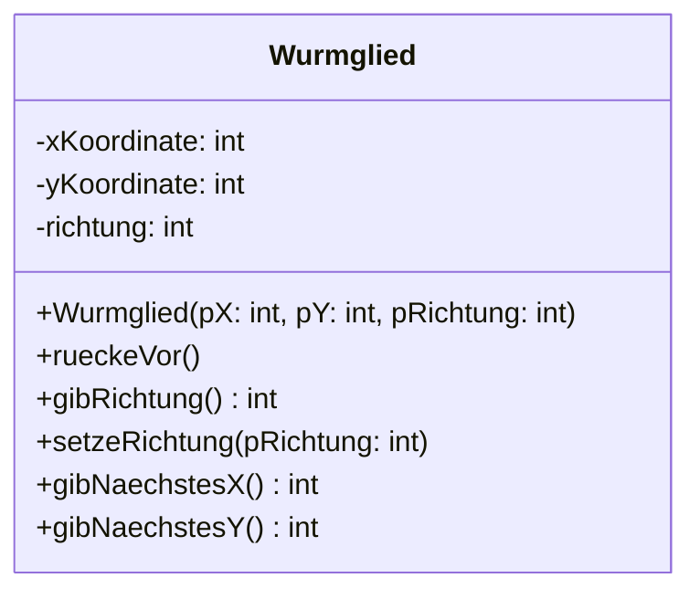
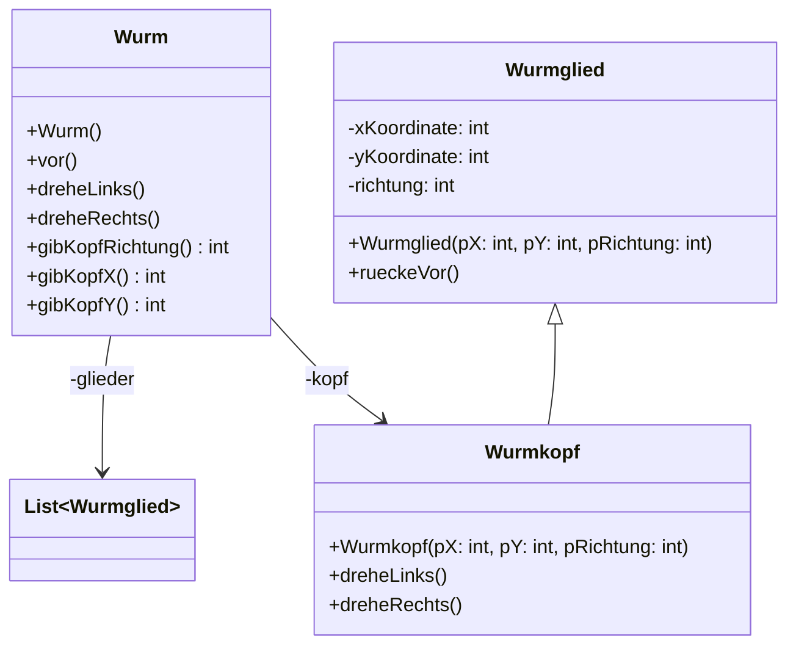
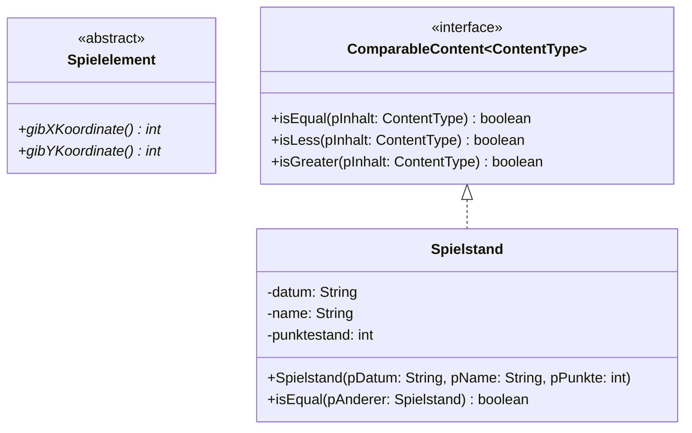

# Implementationsdiagramm

Ein **Implementationsdiagramm** (englisch *implementation class diagram*) ist ein :t[Klassendiagramm]{#klassendiagramm}, das ein :t[Entwurfsdiagramm]{#entwurfsdiagramm} **präzisiert** und sich an der verwendeten Programmiersprache orientiert. Es beantwortet die Frage *Wie sieht der Quelltext aus?*

Der Prüfstein: Aus einem Implementationsdiagramm lässt sich das Klassengerüst **ohne Rückfragen** schreiben – und umgekehrt.

Die Notation folgt den Vorgaben für das Zentralabitur in Nordrhein-Westfalen.

## Der Klassenkasten

Ein Klassenkasten hat **drei Felder**: Name, Attribute, Methoden.

:::snippet{#merken}
| Zeichen | Bedeutung | in Java |
| --- | --- | --- |
| `-` | nur in dieser Klasse sichtbar | `private` |
| `#` | auch in den Unterklassen sichtbar | `protected` |
| `+` | überall sichtbar | `public` |

Geschrieben wird

- ein Attribut als `sichtbarkeit name: typ`,
- eine Methode als `sichtbarkeit name(parameter: typ): rückgabetyp`.

Der Datentyp steht also immer **hinter** dem Doppelpunkt – beim Attribut, beim Parameter und beim Rückgabewert.

Ein :t[Konstruktor]{#konstruktor} heißt wie die Klasse und hat keinen Rückgabetyp. Eine Methode ohne Rückgabewert bekommt auch keinen: Bei ihr endet die Zeile hinter der Klammer, das `void` aus dem Quelltext taucht im Diagramm nicht auf.
:::

## Beziehungen

Statt Multiplizitäten stehen hier **konkrete Bezeichner** – die Namen der Attribute, durch die die Assoziationen umgesetzt sind, samt ihrer Sichtbarkeit.

Bei den für das Zentralabitur **dokumentierten Klassen** – `List`, `Stack`, `Queue`, `BinaryTree`, … – wird auf die Angabe der Attribute und Methoden verzichtet; der Kasten bleibt leer. Der Typparameter sagt, welche Inhaltsobjekte dort verwaltet werden.

## Besondere Klassen

:::snippet{#merken}
| Was | Wie es gezeichnet wird |
| --- | --- |
| abstrakte Klasse | `{abstract}` rechtsbündig unter dem Klassennamen |
| abstrakte Methode | kursiv – handschriftlich mit einer Wellenlinie unterschlängelt |
| Klassenmethode, Klassenattribut | unterstrichen |
| :t[Schnittstelle]{#schnittstelle} | `<<interface>>` über dem Klassennamen |
| Vererbung | durchgezogene Linie, geschlossene leere Pfeilspitze |
| Umsetzung einer Schnittstelle | **gestrichelte** Linie, geschlossene leere Pfeilspitze |
| generische Klasse | Typparameter im gestrichelten Kasten oben rechts |
:::

<!-- Dieselbe Tabelle in Mermaid-Schreibweise, nur fuer Autorinnen und Autoren:
     abstrakte Klasse          <<abstract>> im Kasten
     abstrakte Methode         * ans Zeilenende
     Klassenmethode/-attribut  $ ans Zeilenende
     Schnittstelle             <<interface>> im Kasten
     Vererbung                 Oberklasse <|-- Unterklasse
     Schnittstelle umsetzen    Schnittstelle <|.. Klasse
     generische Klasse         Klasse~Typ~ -->

<!-- Mermaid-Notation, nur fuer Autorinnen und Autoren:
     Rueckgabetyp OHNE Doppelpunkt anhaengen (`+gibRichtung() int`) - Mermaid setzt das ` : ` selbst.
     Attribute und Parameter dagegen mit Doppelpunkt, die gibt Mermaid woertlich aus.
     Generics als Tilden: `List~Wurmglied~` wird zu `List<Wurmglied>`.
     Klassifizierer ans Zeilenende: `*` abstrakt (kursiv), `$` statisch (unterstrichen). -->
