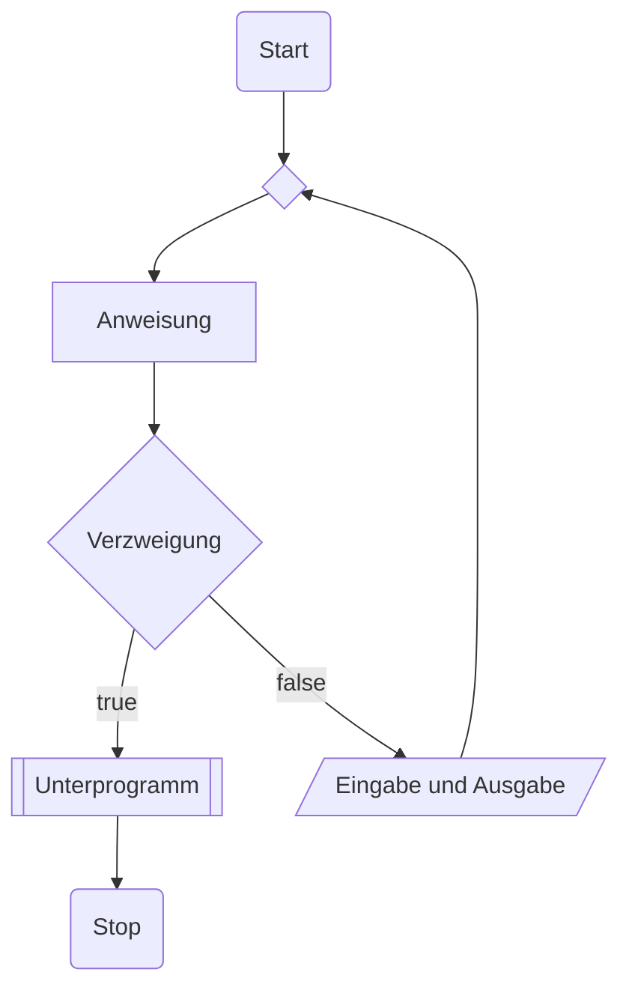
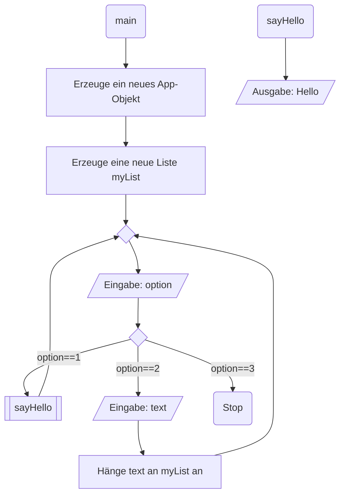

# Programmablaufplan

Ein Programmablaufplan (PAP) ist ein Ablaufdiagramm für ein Computerprogramm, das auch als Flussdiagramm (engl. flowchart) oder Programmstrukturplan bezeichnet wird. Es ist eine grafische Darstellung zur Umsetzung eines Algorithmus in einem Programm und beschreibt die Folge von Operationen zur Lösung einer Aufgabe. (vgl. [Wikipedia](https://de.wikipedia.org/wiki/Programmablaufplan))

Ein PAP besteht aus folgenden Komponenten: 



[Bearbeiten im Mermaid Live Editor](https://mermaid.live/edit#pako:eNpNUTtvgzAQ_ivWTY1EEh6RDQyVkkA6dUrbIcDggiFIwUbGVpoQ_nsNpFJvuu9xp-90PeSiYBBCeRHX_EylQh9RypGp7ctRGbxAy-Ur2vVomOndhPfJll9Z3WleZTO_n_io_2LybpTKKM-JaFQeSmr2QHGSfHLFZCtFJWnTZNl_T0kvnTEdknVc84p-M6R5gba6G_v103qYA80gnsCbiSraBVjQMNnQujAH9aMhBXVmDUshNG3BSqovKoWUD8ZKtRLHG88hHKNZoNuCKhbVdAz2R7aUQ9jDD4TEWbkYbxzbdwn2MHEtuEHo45VjY5s4G-I6mARksOAuhJm3V8THTuDZm8DzPTcI_GnbaRLn5ayolZDv8wOmPwy_E753tg)

## Beispiel

Gegeben ist das folgende Java-Programm

```java
public class App {

    public App() {
        List myList = new List<>();
        while(true) {
            Scanner scanner = new Scanner(System.in);
            int option = scanner.nextInt();
            if (option == 1) {
                sayHello();
            } else if (option == 2) {
                String text = scanner.nextLine();
                myList.append(text);
            } else if (option == 3) {
                System.exit(0);
            }
        }
    }

    public void sayHello() {
        System,out.println("Hello");
    }


    public static void main(String[] args) {
        new App();
    }
}
```

In einem PAP dargestellt würde das Programm so aussehen.



[Bearbeiten im Mermaid Live Editor](https://mermaid.live/edit#pako:eNp1ks1ygjAQx18lk5PO-AFIAzJjZ1Dxa9rpwZ4KHqKsSgsJA2Eqom_TN-mLFQJ2PLTJIdns77-bbLbAO-4DtvA-5J-7I00Eep16DJXDbkU0YG3U7T6iseskZ8gOgCBgiEEGKbLjuPuyfYcPsakFY4ku71GQLHoKUgEoyqu1gZcSnhToWtsTaU_dvhOwA92ChXgsAs76DT-VfueXdyr7UjOjkXpBM9dNab6AMOSbRjOrc_wl0C5ofpdLwEncMs2lauUuvr9Y-YrKhShrbl_uGmz1f_DBBS1aa8HjtseqKatpt27Xq0tqj92-naV1fnmO-hvcwREkZd398kuKSulhcYQIPGyVWx_2NAuFhz12LVGaCb7O2Q5bIsmgg7PYpwKmAT0kNLodxpRhq8AnbBlqTyNEVxVTM8iAGFoH59gySU9ViGKouqGpxBga1w4-c17qlZ5hEnU4UB50c0B0U9dktDfprIODHwiePNctJDvp-gPJJbHo)