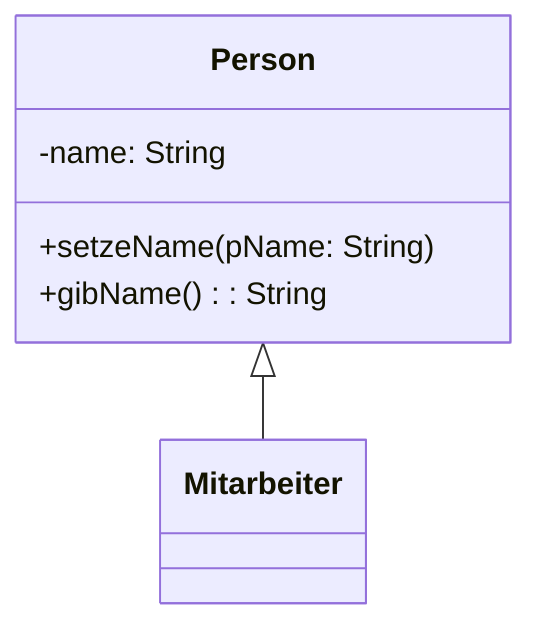

Die Vererbungsbeziehung wird in Java mit dem Schlüsselwort extends beschrieben. Beispiel:



::::tabs{id="111"}

:::tab{title="Person.java" id="1"}

```java
public class Person {
    private String name;
    public void setzeName(String pName) {
        name = pName;
    }
    public String gibName() {
        return name;
    }
}
```

:::

:::tab{title="Mitarbeiter.java" id="2"}

```java
public class Mitarbeiter extends Person {
    int mitarbeiterNummer

    public Mitarbeiter() {
        mitarbeiterNummer = 1;
    }
}
```

:::

::::


Die Klasse Mitarbeiter ist eine Spezialisierung der Klasse Person. Sie erbt die öffentlichen Attribute und Methoden der Klasse Person. 

Oberklassen vererben öffentliche (public, protected) Methoden und Attribute an Unterklassen. Das heißt, dass sie wie eigene Attribute verwendet werden können.

Das heißt auf Objekte der Klasse Mitarbeiter kann zum Beispiel die Methode setzeName aufgerufen werden.

```java
Mitarbeiter meinMitarbeiter = new Mitarbeiter();
meinMitarbeiter.setzeName("Paul");
```

Alle Klassen in Java erben direkt oder indirekt von der Java Basisklasse Object. Wird bei einer Klassendeklaration keine extends Klausel angegeben so wird die Klasse automatisch von der Klasse Object abgeleitet.

# Prüfe dich

Gegeben sind die folgenden beiden Klassen. Beantworte die nachstehenden Fragen.

::::tabs{id="112"}

:::tab{title="Fahrzeug.java" id="1"}

```java
public class Fahrzeug {
    private Color farbe;
    public float geschwindigkeit;

    public void setzeFarbe(Color neueFarbe) {
        farbe = neueFarbe;
    }
    public Color gibFarbe() {
        return farbe;
    }
}
```

:::

:::tab{title="PKW.java" id="2"}

```java
public class PKW extends Fahrzeug {
    private boolean hatKofferraum;

    public PKW(boolean pHatKofferraum) {
        hatKofferraum = pHatKofferraum;
    }
}
```

:::

::::

1. Überprüfe, ob der folgende Quelltext gültig ist.

```java
PKW kleinesAuto = new PKW(true);
kleinesAuto.farbe;
```

:::collapsible{title="Lösung" id="5"}
Nein! Das Attribut farbe ist **private** und somit nicht aus Unterklassen erreichbar.
:::

2. Überprüfe, ob der folgende Quelltext gültig ist.

```java
PKW kleinesAuto = new PKW(true);
kleinesAuto.geschwindigkeit;
```

:::collapsible{title="Lösung" id="4"}
Ja! Das Attribut geschwindigkeit der Klasse Fahrzeug ist public und wird somit an die Unterklasse PKW vererbt. Daher kann auf das Attribut zugegriffen werden.
:::

3. Überprüfe, ob der folgende Quelltext gültig ist.

```java
PKW kleinesAuto = new PKW(true);
kleinesAuto.gibFarbe();
```

:::collapsible{title="Lösung" id="3"}
Ja! Die Methode gibFarbe der Klasse Fahrzeug ist public und wird somit an die Unterklasse vererbt. Daher kann auf die Methode zugegriffen werden.
:::

4. Überprüfe, ob der folgende Quelltext gültig ist.

```java
PKW kleinesAuto = new PKW(true);
kleinesAuto.hatKofferraum;
```

:::collapsible{title="Lösung" id="2"}
Nein! Das Attribut hatKofferraum ist private und somit nicht außerhalb der Klasse PKW verfügbar.
:::

5. Überprüfe, ob der folgende Quelltext gültig ist.

```java
Fahrzeug kleinesAuto = new Fahrzeug();
kleinesAuto.hatKofferraum;
```

:::collapsible{title="Lösung" id="1"}
Nein! Das Attribut hatKofferraum ist nur in der Klasse PKW verfügbar, da PKW eine Unterklasse von Fahrzeug ist. 
:::